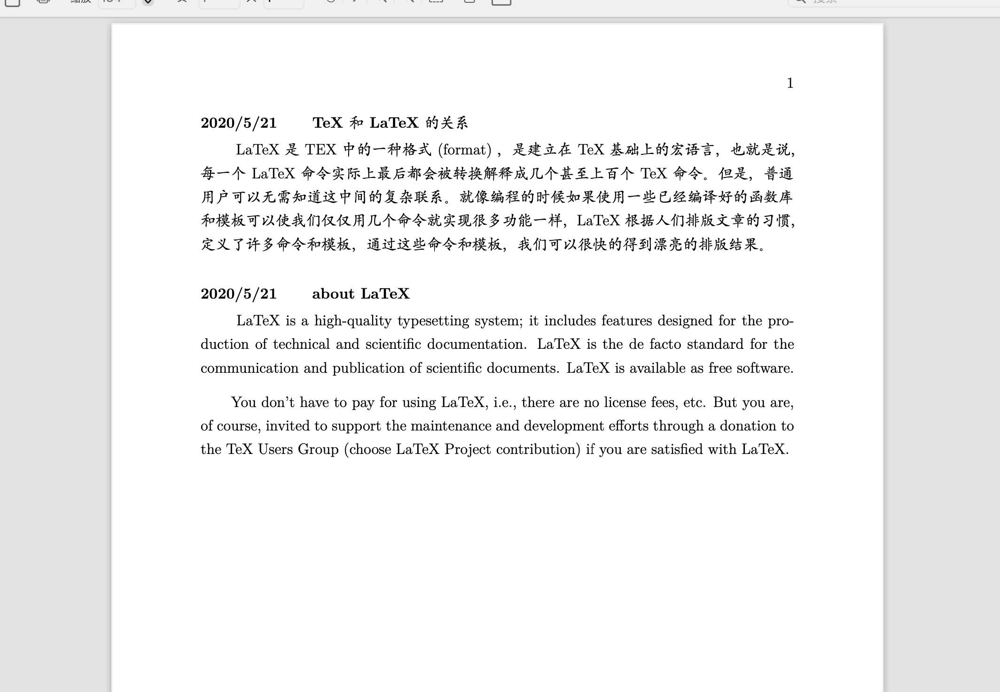

# 备忘录模版

最近有对备忘录的需求，所以简单写了一个 LaTEX 的备忘录模板，也可以当作日记使用。

## 模板代码

```latex
%!TEX TS-program = xelatex
%!TEX encoding = UTF-8 Unicode

\documentclass[12pt]{book}

% 控制页面边距
\usepackage{geometry}
\geometry{letterpaper, margin=2.5cm}

% 段落首行缩进
\usepackage {indentfirst}
\setlength{\parindent}{2.0em} %2em代表首行缩进两个字符
\setlength{\lineskip}{0.2em} %设置行间距
\setlength{\parskip}{0.7em} %设置段落间距

\newenvironment{loggentry}[2]% date, heading
{\noindent\textbf{#1} \qquad \textbf{#2}\vspace{0.2em} \\  \indent}{\vspace{1em}}

%%%%%%%%%%%%%%%%%%%%%%%%%%%%%%%%%%%%%%%%%
%%% 字体
%%%%%%%%%%%%%%%%%%%%%%%%%%%%%%%%%%%%%%%%%
\usepackage{ctex}
% 设置中文字体
\setCJKmainfont {Kai Regular}
% 设置正文罗马族的CJK字体，影响\rmfamily和\textrm 的字体
\setCJKsansfont {Kai Regular}
% 设置正文无衬线族的CJK字体，影响\sffamily和\textsf 的字体
\setCJKmonofont {Kai Regular}

%%%%%%%%%%%%%%%%%%%%%%%%%%%%%%%%%%%%%%%%%%
%%%  正文内容
%%%%%%%%%%%%%%%%%%%%%%%%%%%%%%%%%%%%%%%%%%
\begin{document}

\begin{loggentry}{2020/5/21}{TeX 和LaTeX 的关系}
LaTeX 是TEX 中的一种格式(format) ，是建立在TeX 基础上的宏语言，也就是说，每一个LaTeX 命令实际上最后都会被转换解释成几个甚至上百个TeX 命令。但是，普通用户可以无需知道这中间的复杂联系。就像编程的时候如果使用一些已经编译好的函数库和模板可以使我们仅仅用几个命令就实现很多功能一样，LaTeX 根据人们排版文章的习惯，定义了许多命令和模板，通过这些命令和模板，我们可以很快的得到漂亮的排版结果。
\end{loggentry}

\begin{loggentry}{2020/5/21}{about LaTeX}
LaTeX is a high-quality typesetting system; it includes features designed for the production of technical and scientific documentation. LaTeX is the de facto standard for the communication and publication of scientific documents. LaTeX is available as free software.

You don't have to pay for using LaTeX, i.e., there are no license fees, etc. But you are, of course, invited to support the maintenance and development efforts through a donation to the TeX Users Group (choose LaTeX Project contribution) if you are satisfied with LaTeX.
\end{loggentry}

\end{document}  
```

## 效果展示


