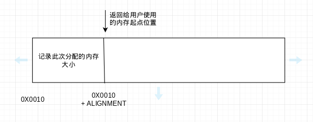
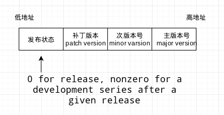

# Libevent-book 学习

Libevent-book 是 Libevent 官方手册。最近想学习一下 Libevent，所以先从官方手册看起。libevent-book 的 Github 地址：https://github.com/nmathewson/libevent-book。Github 上面提供的是 AsciiDoc 格式的文本，如果想看 PDF 版本的书籍的话，需要自己编译一下，我电脑上没有成功生成 PDF，所以只能生成 HTML 来看，生成的 HTML 代码放在当前目录下。


## 简介

  简单介绍一下各章节内容

``` bash
.
├── 00_about.html  没啥内容
├── 01_intro.html  介绍了下异步 I/O 的发展，Libevent 的优势 
├── license_bsd.html  
├── Ref0_meta.html   介绍了下 Libevent 的结构和版本差异
├── Ref1_libsetup.html  介绍了启动、初始化、debug 的一些接口
├── Ref2_eventbase.html 介绍了如何设置 event_base
├── Ref3_eventloop.html 介绍了 event loop 的启动，设置，退出
├── Ref4_event.html
├── Ref5_evutil.html
├── Ref6a_advanced_bufferevents.html
├── Ref6_bufferevent.html
├── Ref7_evbuffer.html
├── Ref8_listener.html
├── Ref9_dns.html
└── TOC.html
```


## Ref1_libsetup.html

> ## Setting up the Libevent library
>
> Libevent 有几个全局设置，最好在使用 Libevent 的其他功能前设置好这些参数。


### Libevent 的日志

Libevent 默认将 日志信息输出到 stderr，你可以通过提供自己的日志函数来代替默认函数。下面是 Libevent 提供的接口。

``` c
#define EVENT_LOG_DEBUG 0
#define EVENT_LOG_MSG   1
#define EVENT_LOG_WARN  2
#define EVENT_LOG_ERR   3

/* Deprecated; see note at the end of this section */
#define _EVENT_LOG_DEBUG EVENT_LOG_DEBUG
#define _EVENT_LOG_MSG   EVENT_LOG_MSG
#define _EVENT_LOG_WARN  EVENT_LOG_WARN
#define _EVENT_LOG_ERR   EVENT_LOG_ERR

typedef void (*event_log_cb)(int severity, const char *msg);

void event_set_log_callback(event_log_cb cb);
```

  如果想要修改默认的日志行为，只要将自己的日志函数的函数指针提供给 `event_set_log_callback` 函数就行了。如果想将日志行为修改为 Libevent 的默认行为，只要使用 NULL 作为参数再调用一次 `event_set_log_callback` 就行了。

**示例**

``` c
#include <event2/event.h>
#include <stdio.h>

// 丢弃所有日志信息的日志函数
static void discard_cb(int severity, const char *msg)
{
    /* This callback does nothing. */
}

static FILE *logfile = NULL;
// 将日志信息写入到文件的日志函数
static void write_to_file_cb(int severity, const char *msg)
{
    const char *s;  // 记录日志等级
    if (!logfile)  // 文件指针为空，直接返回
        return;
    switch (severity) {
        case _EVENT_LOG_DEBUG: s = "debug"; break;
        case _EVENT_LOG_MSG:   s = "msg";   break;
        case _EVENT_LOG_WARN:  s = "warn";  break;
        case _EVENT_LOG_ERR:   s = "error"; break;
        default:               s = "?";     break; /* never reached */
    }
    fprintf(logfile, "[%!s(MISSING)] %!s(MISSING)\n", s, msg);
}

/* Turn off all logging from Libevent. */
void suppress_logging(void)
{
    event_set_log_callback(discard_cb);
}

/* Redirect all Libevent log messages to the C stdio file 'f'. */
void set_logfile(FILE *f)
{
    logfile = f;
    event_set_log_callback(write_to_file_cb);
}
```

  使用这个接口是有两点需要注意：

1. 在你自己写的日志处理函数里面调用 Libevent 的其他函数是不安全的。
2. debug log 默认不打开。

``` c
// 打开 debug logs 的接口函数
#include <event2/event.h>

#define EVENT_DBG_NONE 0
#define EVENT_DBG_ALL 0xffffffffu

void event_enable_debug_logging(ev_uint32_t which);
```


### 处理致命错误

  Linevent 遇到致命错误默认是调用 `exit()` 或者 `abort()` ，但是 Libevent 也给你提供了接口让你可以接手 Libevent 来自己处理致命错误。

``` c
#include <event2/event.h>

typedef void (*event_fatal_cb)(int err);
void event_set_fatal_callback(event_fatal_cb cb);
```

  你可以自己写错误处理函数然后传给 `event_set_fatal_callback` 就行。**重要的一点是，你写的错误处理函数不要再将控制流还给 Libevent。**


### 内存管理

  Libevent 默认使用 C 标准库提供的内存管理函数，但是如果想用自己的内存管理函数也行，Libevent 提供了接口。

``` c
#include <event2/event.h>

void event_set_mem_functions(void *(*malloc_fn)(size_t sz),
                             void *(*realloc_fn)(void *ptr, size_t sz),
                             void (*free_fn)(void *ptr));
```

  下面是一个实例展示了如何使用自己的内存管理函数，功能是统计分配了多少字节的内存。不过这个例子不是多线程安全的。

``` c
#include <event2/event.h>
#include <sys/types.h>
#include <stdlib.h>

/* This union's purpose is to be as big as the largest of all the
 * types it contains. */
union alignment {
    size_t sz;
    void *ptr;
    double dbl;
};
/* We need to make sure that everything we return is on the right
   alignment to hold anything, including a double. */
#define ALIGNMENT sizeof(union alignment)

/* We need to do this cast-to-char* trick on our pointers to adjust
   them; doing arithmetic on a void* is not standard. */
#define OUTPTR(ptr) (((char*)ptr)+ALIGNMENT)
#define INPTR(ptr) (((char*)ptr)-ALIGNMENT)

static size_t total_allocated = 0;  // 记录总共分配了多少内存
static void *replacement_malloc(size_t sz)
{
    void *chunk = malloc(sz + ALIGNMENT);
    if (!chunk) return chunk;
    total_allocated += sz;
    *(size_t*)chunk = sz;
    return OUTPTR(chunk);
}
static void *replacement_realloc(void *ptr, size_t sz)
{
    size_t old_size = 0;
    if (ptr) {
        ptr = INPTR(ptr);
        old_size = *(size_t*)ptr;
    }
    ptr = realloc(ptr, sz + ALIGNMENT);
    if (!ptr)
        return NULL;
    *(size_t*)ptr = sz;
    total_allocated = total_allocated - old_size + sz;
    return OUTPTR(ptr);
}
static void replacement_free(void *ptr)
{
    ptr = INPTR(ptr);
    total_allocated -= *(size_t*)ptr;
    free(ptr);
}
void start_counting_bytes(void)
{
    event_set_mem_functions(replacement_malloc,
                            replacement_realloc,
                            replacement_free);
}
```

  上面这段代码还是比较有意思的，为了记录每次分配多多少内存，它会将分配了多少内存记录在指针的头部。解释如下图。




  几个需要注意的点：

1. 最好将修改内存函数放到 Libevent 初始化的部分，不然的话可能导致内存管理的混乱（调用 C 标准库的 malloc 申请内存，调用你提供的 free 释放内存之类的问题）。
2. 自己提供的内存管理函数 malloc 和 realloc 行为要和 C 标准库的一致（比如 C 标准库的 malloc(16) 返回申请到的 16 字节内存的初始地址，自己提供的不要只申请 8 字节之类）。
3. 自己提供的 realloc 函数要能正确处理 `realloc(NULL, sz)` 这种情况，即要当作 `malloc(sz)` 处理。
4. 自己提供的 realloc 函数要能正确处理 `realloc(ptr, 0)` 这种情况，即要当作 `free(ptr)` 处理。
5. 自己提供的内存管理函数对 `free(NULL)`,  `malloc(0)` 做特殊处理。
6. 如果要将 Libevent 用在多线程环境下，要要保证提供的内存管理函数是线程安全的。
7. 内存管理函数 malloc, realloc, free 最好提供全套的，不要只提供其中几个。


### 锁和线程

  如果你用的是 pthreads 库 或者 Windows threading code，那么 Libevent 已经帮你定义好了多线程操作相关的函数。

``` c
#ifdef WIN32
int evthread_use_windows_threads(void);
#define EVTHREAD_USE_WINDOWS_THREADS_IMPLEMENTED
#endif
#ifdef _EVENT_HAVE_PTHREADS
int evthread_use_pthreads(void);
#define EVTHREAD_USE_PTHREADS_IMPLEMENTED
#endif
```

  这两个函数都是返回 0 代表成功，返回 -1 代表失败。

  如果你用的是其他的线程库的话，那么你使用的库需要实现了如下功能：

* Locks
* locking
* unlocking
* lock allocation
* lock destruction
* Conditions
* condition variable creation
* condition variable destruction
* waiting on a condition variable
* signaling/broadcasting to a condition variable
* Threads
* thread ID detection

  然后还需要 调用 `evthread_set_lock_callbacks` 和 `evthread_set_id_callback` 这两个接口来设置一下 Libevent。

``` c
#define EVTHREAD_WRITE  0x04
#define EVTHREAD_READ   0x08
#define EVTHREAD_TRY    0x10

#define EVTHREAD_LOCKTYPE_RECURSIVE 1
#define EVTHREAD_LOCKTYPE_READWRITE 2

#define EVTHREAD_LOCK_API_VERSION 1

struct evthread_lock_callbacks {
       int lock_api_version;
       unsigned supported_locktypes;
       void *(*alloc)(unsigned locktype);
       void (*free)(void *lock, unsigned locktype);
       int (*lock)(unsigned mode, void *lock);
       int (*unlock)(unsigned mode, void *lock);
};

int evthread_set_lock_callbacks(const struct evthread_lock_callbacks *);

void evthread_set_id_callback(unsigned long (*id_fn)(void));

struct evthread_condition_callbacks {
        int condition_api_version;
        void *(*alloc_condition)(unsigned condtype);
        void (*free_condition)(void *cond);
        int (*signal_condition)(void *cond, int broadcast);
        int (*wait_condition)(void *cond, void *lock,
            const struct timeval *timeout);
};

int evthread_set_condition_callbacks(
        const struct evthread_condition_callbacks *);
```

  针对自己提供的线程库还有很多要求和限制，具体要求可以到上传的 html 文件中查看。


### 调试锁错误

  为了帮助用户调试锁的一些错误， Libevent 提供了一个 `lock debugging` 特性。它可以帮助定位如下错误类型：

1. 释放了一个未持有的锁
2. 试图对已经锁住的非递归锁再次加锁

如果这些错误发生， Libevent 会触发一个断言。

``` c
void evthread_enable_lock_debugging(void);
#define evthread_enable_lock_debuging() evthread_enable_lock_debugging()
```

  这个函数必须在调用任何锁之前使用，为了安全起见，最好在设置了线程函数后就调用。


### 调试 event

  Libevent 在你使用 events 的时候，可以发现并报告如下两种错误：

1. 使用未初始化的 event
2. 对已经初始化的 event 重新初始化

  跟踪 event 的初始化需要消耗额外的 CPU 和 内存资源，所以最好只在需要 debug 的时候才打开 debug 模式。

``` c
// 接口
void event_enable_debug_mode(void);
```

  这个函数只能在 event_base 创建之前调用。

  在使用 debug 模式的时候，如果你的程序中使用了大量由 `event_assign()` 创建的 events，那么内存可能会被耗尽。这是因为使用 `event_assign()` 创建的 events   没有办法知道何时失效（不再被使用）。为了在 debug 的时候避免这个问题，你可以通过调用如下函数来明确的告诉 Libevent events 何时失效。

``` c
void event_debug_unassign(struct event *ev);
```

使用例子

``` c
#include <event2/event.h>
#include <event2/event_struct.h>

#include <stdlib.h>

void cb(evutil_socket_t fd, short what, void *ptr)
{
    /* We pass 'NULL' as the callback pointer for the heap allocated
     * event, and we pass the event itself as the callback pointer
     * for the stack-allocated event. */
    struct event *ev = ptr;

    if (ev)
        event_debug_unassign(ev);
}

/* Here's a simple mainloop that waits until fd1 and fd2 are both
 * ready to read. */
void mainloop(evutil_socket_t fd1, evutil_socket_t fd2, int debug_mode)
{
    struct event_base *base;
    struct event event_on_stack, *event_on_heap;

    if (debug_mode)
       event_enable_debug_mode();

    base = event_base_new();

    event_on_heap = event_new(base, fd1, EV_READ, cb, NULL);
    event_assign(&event_on_stack, base, fd2, EV_READ, cb, &event_on_stack);

    event_add(event_on_heap, NULL);
    event_add(&event_on_stack, NULL);

    event_base_dispatch(base);

    event_free(event_on_heap);
    event_base_free(base);
}
```

  Detailed event debugging 是一个只能在编译时通过开启 CFLAGS 参数 “-DUSE_DEBUG” 来使用的特性，Libevent 里面没有提供相应的 API 来开启或关闭。开启了这个参数会在使用 Libevent 的时候输出许多日志，包括但不限于如下日志：

* event additions
* event deletions
* platform specific event notification information


### 检测 Libevent 的版本

  这个主要是提供了两个宏和两个函数来让你可以知道 Libevent 的 run-time 版本，来根据版本实现条件编译。

``` c
#include <event2/event.h>

#define LIBEVENT_VERSION_NUMBER 0x02000300
#define LIBEVENT_VERSION "2.0.3-alpha"
const char *event_get_version(void);
ev_uint32_t event_get_version_number(void);
```

  你可以通过两种格式获取 Libevent 的版本：字符串或者一个 4 字节整数。对于 4 字节整数来说：



编译时期检查例子：

``` c
#include <event2/event.h>

#if !defined(LIBEVENT_VERSION_NUMBER) || LIBEVENT_VERSION_NUMBER < 0x02000100
#error "This version of Libevent is not supported; Get 2.0.1-alpha or later."
#endif

int
make_sandwich(void)
{
        /* Let's suppose that Libevent 6.0.5 introduces a make-me-a
           sandwich function. */
#if LIBEVENT_VERSION_NUMBER >= 0x06000500
        evutil_make_me_a_sandwich();
        return 0;
#else
        return -1;
#endif
}
```

运行时期检查例子：

``` c
#include <event2/event.h>
#include <string.h>

int
check_for_old_version(void)
{
    const char *v = event_get_version();
    /* This is a dumb way to do it, but it is the only thing that works
       before Libevent 2.0. */
    if (!strncmp(v, "0.", 2) ||
        !strncmp(v, "1.1", 3) ||
        !strncmp(v, "1.2", 3) ||
        !strncmp(v, "1.3", 3)) {

        printf("Your version of Libevent is very old.  If you run into bugs,"
               " consider upgrading.\n");
        return -1;
    } else {
        printf("Running with Libevent version %!s(MISSING)\n", v);
        return 0;
    }
}

int
check_version_match(void)
{
    ev_uint32_t v_compile, v_run;
    v_compile = LIBEVENT_VERSION_NUMBER;
    v_run = event_get_version_number();
    if ((v_compile & 0xffff0000) != (v_run & 0xffff0000)) {
        printf("Running with a Libevent version (%!s(MISSING)) very different from the "
               "one we were built with (%!s(MISSING)).\n", event_get_version(),
               LIBEVENT_VERSION);
        return -1;
    }
    return 0;
}
```


### 释放 Libevent 的全局数据结构

  其实不释放也是可以的，但是在 debug 的时候可能会造成一些 debug 工具的问题，比如认为内存泄漏了之类，所以 Libevent 提供了接口：

``` c
#include <event2/event.h>

void libevent_global_shutdown(void);
```

  不过在调用完这个函数之后最好不要再调用其他 Libevent 函数，不然可能出现未定义错误。


## Ref2_eventbase.html


### 创建一个 event_base

  event_base 持有 event 集合，并决定如何调度 event。如果 event_base 被设置为带锁的，那么它就是线程安全的，可以在多线程间传递，但是事件循环只能在单个线程内进行（未来可能支持在多个线程中执行 events，#TODO 感觉翻译错了）。

  每个 event_base 都有一个 I/O 复用后端（函数），用来调度 events。主流方法如下：

* select
* poll
* epoll
* kqueue
* devpoll
* evport
* win32

  Libevent 提供了宏让你可以使 Libevent 忽略(disable) 某个方法。


### 设置默认的 event_base

`event_base_new()` 函数生成并返回一个指向具有默认设置的 event_base 的指针。如果出现错误，返回 NULL。

``` C
#include <event2/event.h>

struct event_base *event_base_new(void);
```


### 设置一个自定义的 event_base

  使用 `event_config` 来对 `event_base` 的行为进行控制。通过将设置过的 `event_config` 传入 `event_base_new_with_config()` 就可以得到一个自定义的 `event_base` 。

``` c
struct event_config *event_config_new(void);
struct event_base *event_base_new_with_config(const struct event_config *cfg);
void event_config_free(struct event_config *cfg);
```

  具体的调用流程就是：

1. 先调用 `event_config_new()` 来获得一个 `event_config`。
2. 调用其他函数来修改 `event_config`。
3. 调用 `event_base_new_with_config()` 来获得一个自定义的 `event_base`。
4. 如果设置完成，调用 `event_config_free()` 来释放 `event_config`。

``` c
int event_config_avoid_method(struct event_config *cfg, const char *method);

enum event_method_feature {
    EV_FEATURE_ET = 0x01,
    EV_FEATURE_O1 = 0x02,
    EV_FEATURE_FDS = 0x04,
};
int event_config_require_features(struct event_config *cfg,
                                  enum event_method_feature feature);

enum event_base_config_flag {
    EVENT_BASE_FLAG_NOLOCK = 0x01,
    EVENT_BASE_FLAG_IGNORE_ENV = 0x02,
    EVENT_BASE_FLAG_STARTUP_IOCP = 0x04,
    EVENT_BASE_FLAG_NO_CACHE_TIME = 0x08,
    EVENT_BASE_FLAG_EPOLL_USE_CHANGELIST = 0x10,
    EVENT_BASE_FLAG_PRECISE_TIMER = 0x20
};
int event_config_set_flag(struct event_config *cfg,
    enum event_base_config_flag flag);
```

  调用 `event_config_avoid_method()` 可以告诉 Libevent 不使用某种 I/O 复用方法。调用 `event_config_require_feature()` 告诉 Libevent 不要使用不能提供某些特性的 I/O 复用方法。调用 `event_config_set_flag()` 告诉 Libevent 在构造 `event_base` 的时候设置上面代码中列出的一些 flag。具体各个 flag 的含义可以参考 上传的 html。

``` c
int event_config_set_num_cpus_hint(struct event_config *cfg, int cpus)
```

  Windows IOCP 专用，就是告诉 Libevent 建议使用的 CPU 数目，但不一定听。

``` c
int event_config_set_max_dispatch_interval(struct event_config *cfg,
    const struct timeval *max_interval, int max_callbacks,
    int min_priority);
```

  用来防止出现优先级反转的函数。通过限制在调用高优先级的 events 之前能调用低优先级的 events 得次数来实现目的。


### 测试 event_base 的后端方法（I/O 复用方法）

  通过调用如下函数来查看系统能使用的 backend 方法：

``` c
const char **event_get_supported_methods(void);
```

``` c
#include<stdio.h>
#include<event2/event.h>

int main() {
	const char **support = event_get_supported_methods();
	for (int i = 0; support[i] != NULL; ++i) {
		printf("%s\n", support[i]);
	}
	return 0;
}

// 编译命令 gcc -levent
// epoll
// poll
// select
```

  

``` c
const char *event_base_get_method(const struct event_base *base);
enum event_method_feature event_base_get_features(const struct event_base *base);
```

`event_base_get_method()` 方法返回 event_base 实际使用的后端方法。 `event_base_get_features()` 返回 `event_base` 支持的特性的位掩码。

``` c
struct event_base *base;
enum event_method_feature f;

base = event_base_new();
if (!base) {
    puts("Couldn't get an event_base!");
} else {
    printf("Using Libevent with backend method %!s(MISSING).",
        event_base_get_method(base));
    f = event_base_get_features(base);
    if ((f & EV_FEATURE_ET))
        printf("  Edge-triggered events are supported.");
    if ((f & EV_FEATURE_O1))
        printf("  O(1) event notification is supported.");
    if ((f & EV_FEATURE_FDS))
        printf("  All FD types are supported.");
    puts("");
}
```


### 销毁 event_base

  当 `event_base` 使用完成后，可以调用如下函数释放 `event_base` 。

``` c
void event_base_free(struct event_base *base);
```

  这个函数只是释放 `event_base` 但是并不会释放 `event_base` 中的 `events` ，sockets 之类资源。


### 设置 event_base 的优先级

  Libevent 支持在一个 event 上设置多重优先级。不过默认情况下， `event_base` 默认只支持单级优先级。你可以通过调用 `event_base_priority_init()` 来设置 `event_base` 上的优先级数。

``` c
int event_base_priority_init(struct event_base *base, int n_priorities);
```

  调用这个函数的建议时间是创建后 `event_base` 后。为了知道当前 `event_base` 支持的优先级，可以调用如下函数：

``` c
int event_base_get_npriorities(struct event_base *base);
```

  由 `event_base` 创建的 event 的默认优先级是 `n_priorities / 2` 。


### 调用 fork() 后对 event_base 重新初始化

  部分 event backends(I/O 复用函数) 会在 `fork()` 后丢失 `event_base` 的设置（），所以我们需要重新初始化。

``` c
int event_reinit(struct event_base *base);
```

  例子:

``` c
struct event_base *base = event_base_new();

/* ... add some events to the event_base ... */
if (fork()) {
    /* In parent */
    continue_running_parent(base); /*...*/
} else {
    /* In child */
    event_reinit(base);
    continue_running_child(base); /*...*/
}有
```


### 废弃掉的函数

| Current function           | Obsolete current-base version |
| -------------------------- | ----------------------------- |
| event_base_priority_init() | event_priority_init()         |
| event_base_get_method()    | event_get_method()            |


## Ref3_eventloop.html


### 启动 loop

``` c
#define EVLOOP_ONCE             0x01
#define EVLOOP_NONBLOCK         0x02
#define EVLOOP_NO_EXIT_ON_EMPTY 0x04

int event_base_loop(struct event_base *base, int flags);
```

`event_base_loop()` 函数的默认行为是运行一个 `event_base` 直到其里面没有了 events。为了启动一个 loop, `event_base_loop()` 会检查 `event_base` 注册的 events 上是否有事件发生，如果有事件发生，就激活(active) 这些事件并运行（调用回调函数的意思吧）。

  不过可以通过 `flag` 参数来修改 `event_base_loop()` 的默认行为。

* EVLOOP_ONCE： 启动 loop, 等待 `event_base` 上的 events 被激活，运行 events(上的回调函数)，返回。
* EVLOOP_NONBLOCK：启动 loop， 检查 `event_base` 上是否有 events 被激活，有就执行其回调函数，返回。
* EVLOOP_NO_EXIT_ON_EMPTY：不调用 `event_base_loopbreak()` ,  `event_base_loopexit()` 或者出错就不退出。

`event_base_loop()` 的算法：

``` c
while (any events are registered with the loop,
        or EVLOOP_NO_EXIT_ON_EMPTY was set) {

    if (EVLOOP_NONBLOCK was set, or any events are already active)
        If any registered events have triggered, mark them active.
    else
        Wait until at least one event has triggered, and mark it active.

    for (p = 0; p < n_priorities; ++p) {
       if (any event with priority of p is active) {
          Run all active events with priority of p.
          break; /* Do not run any events of a less important priority */
       }
    }

    if (EVLOOP_ONCE was set or EVLOOP_NONBLOCK was set)
       break;
}
```

 有另一个和 `event_base_loop()` 功能相似的函数

``` c
int event_base_dispatch(struct event_base *base);
```

  这个函数被调用后会一直运行直到 `event_base` 上没有 events ，或者调用了 `event_base_loopbreak()` ， `event_base_loopexit()` 。


### 停止 loop

``` c
int event_base_loopexit(struct event_base *base,
                        const struct timeval *tv);
int event_base_loopbreak(struct event_base *base);
```

`event_base_loopexit()` 在到达超时时间后停止 loop, 如果超时时间设置为 NULL，那么立即停止 loop。但是如果 `event_base` 正在执行 events 的回调函数的话，会先等待 **所有 events** 的回调函数执行完再停止 loop。

`event_base_loopbreak()` 函数立即停止 `event_base` 的 loop。它和 `event_base_loopexit(base, NULL)` 的不同之处是它只会等待当前正在执行的那个回调函数执行完便立即退出（#TODO 感觉没有翻译对）。

  在当前没有事件循环执行的情况下调用 `event_base_loopexit(base, NULL)` 和 `event_base_loopbreak()` 的行为也是不同的： 

> loopexit schedules the next instance of the event loop to stop right after the next round of callbacks are run (as if it had been invoked with EVLOOP_ONCE) whereas loopbreak only stops a currently running loop, and has no effect if the event loop isn’t running.

  立即停止事件循环的例子：

``` c
#include <event2/event.h>

/* Here's a callback function that calls loopbreak */
void cb(int sock, short what, void *arg)
{
    struct event_base *base = arg;
    event_base_loopbreak(base);
}

void main_loop(struct event_base *base, evutil_socket_t watchdog_fd)
{
    struct event *watchdog_event;

    /* Construct a new event to trigger whenever there are any bytes to
       read from a watchdog socket.  When that happens, we'll call the
       cb function, which will make the loop exit immediately without
       running any other active events at all.
     */
    watchdog_event = event_new(base, watchdog_fd, EV_READ, cb, base);

    event_add(watchdog_event, NULL);

    event_base_dispatch(base);
}
```

  执行一个 10 秒的事件循环的例子：

``` c
#include <event2/event.h>

void run_base_with_ticks(struct event_base *base)
{
  struct timeval ten_sec;

  ten_sec.tv_sec = 10;
  ten_sec.tv_usec = 0;

  /* Now we run the event_base for a series of 10-second intervals, printing
     "Tick" after each.  For a much better way to implement a 10-second
     timer, see the section below about persistent timer events. */
  while (1) {
     /* This schedules an exit ten seconds from now. */
     event_base_loopexit(base, &ten_sec);

     event_base_dispatch(base);
     puts("Tick");
  }
}
```

  检查事件循环是通过何种方式结束的函数：

``` c
int event_base_got_exit(struct event_base *base);
int event_base_got_break(struct event_base *base);
```

  这两个函数返回 true(???) 表示事件循环是通过 `event_base_loopexit()` 或者 `event_base_break()` 终止的。


### 重新检查 evens

  通常 Libevent 检查 events，然后以最高优先级运行所有 active events，然后再次检查 events，依此类推。 但有时你可能想在当前回调运行后立即停止 Libevent，并告诉它再次重新扫描 events。 与 `event_base_loopbreak()` 类似，你可以使用 `event_base_loopcontinue()` 函数实现这个操作。

``` c
int event_base_loopcontinue(struct event_base *);
```


### 检查内部时间缓存

  比如有时候你想在回调函数里面获取当前时间，就可以使用下面这个函数

``` c
int event_base_gettimeofday_cached(struct event_base *base,
    struct timeval *tv_out);
```

  但是这个时间缓存是 Libevent 开始开始运行回调函数的时候记录的，所以可能不准，那么你可以使用下面这个函数更新：

``` c
int event_base_update_cache_time(struct event_base *base);
```


### 转储（dump）event_base

``` c
void event_base_dump_events(struct event_base *base, FILE *f);
```


### 对 event_base 的每个 event 执行函数

``` c
typedef int (*event_base_foreach_event_cb)(const struct event_base *,
    const struct event *, void *);

int event_base_foreach_event(struct event_base *base,
                             event_base_foreach_event_cb fn,
                             void *arg);
```

  其中 `event_base_foreach_event()` 的 arg 参数会被作为 `event_base_foreach_event_cb()` 的第三个参数。


### 函数修改

| Current function       | Obsolete current-base version |
| ---------------------- | ----------------------------- |
| event_base_dispatch()  | event_dispatch()              |
| event_base_loop()      | event_loop()                  |
| event_base_loopexit()  | event_loopexit()              |
| event_base_loopbreak() | event_loopbreak()             |


## Ref4_event.html


 ### 使用 events

  Libevent 操作的基本单位是 event。event 是可以是下面的事件之一：

* 文件描述符的读写事件
* 超时事件
* 信号事件
* user-triggered 事件

  当 event_base 中注册 event 的时候，event 被初始化，进入 pending 状态。当 event 绑定的事件发生的时候，event 就进入 active 状态，其回调函数开始运行。


## Ref5_evutil.html


### Libevent 的辅助函数和类型

`evutil_socket_t` 保存 socket 号

``` c
#ifdef WIN32
#define evutil_socket_t intptr_t
#else
#define evutil_socket_t int
#endif
```

标准整数类型

| Type        | Width | Signed | Maximum       | Minimum      |
| ----------- | ----- | ------ | ------------- | ------------ |
| ev_uint64_t | 64    | No     | EV_UINT64_MAX | 0            |
| ev_int64_t  | 64    | Yes    | EV_INT64_MAX  | EV_INT64_MIN |
| ev_uint32_t | 32    | No     | EV_UINT32_MAX | 0            |
| ev_int32_t  | 32    | Yes    | EV_INT32_MAX  | EV_INT32_MIN |
| ev_uint16_t | 16    | No     | EV_UINT16_MAX | 0            |
| ev_int16_t  | 16    | Yes    | EV_INT16_MAX  | EV_INT16_MIN |
| ev_uint8_t  | 8     | No     | EV_UINT8_MAX  | 0            |
| ev_int8_t   | 8     | Yes    | EV_INT8_MAX   | EV_INT8_MIN  |

  其他兼容类型

`ev_ssize_t` ： 如果所在平台定义了 `ssize_t` ，那么 `#define ev_ssize_t ssize_t` ，否则设置一个默认的合理数值。

`ev_off_t` ：主要用来表示偏移量，如果平台定义了 `off_t` 那么 `#define ev_off_t off_t` ，在 Windows 平台 `#define ev_off_t ev_int64_t` 。


### 定时器可移植函数

  有些平台没有提供标准的定时器操作函数，所以 Libevent 提供了一个实现。

``` c
#define evutil_timeradd(tvp, uvp, vvp) /* ... */
#define evutil_timersub(tvp, uvp, vvp) /* ... */
```

  这些宏实现的功能是将第一个参数加上或减去第二个参数，将结果放入第三个参数。

``` c
#define evutil_timerclear(tvp) /* ... */
#define evutil_timerisset(tvp) /* ... */
#define evutil_timercmp(tvp, uvp, cmp)
```

  见名知意。


### Socket API 兼容性

  有这些 API 的原因是因为 Windows 平台没有实现 Berkeley sockets API。

``` c
int evutil_closesocket(evutil_socket_t s);
#define EVUTIL_CLOSESOCKET(s) evutil_closesocket(s)
```

  在 Unix 平台，实际调用的函数是 `close()` ，在 Windows 平台，实际调用的函数是 `closesocket()` 。

``` c
#define EVUTIL_SOCKET_ERROR()
#define EVUTIL_SET_SOCKET_ERROR(errcode)
#define evutil_socket_geterror(sock)
#define evutil_socket_error_to_string(errcode)
```


## Ref6_bufferevent.html

### Bufferevents: 概念和基础
