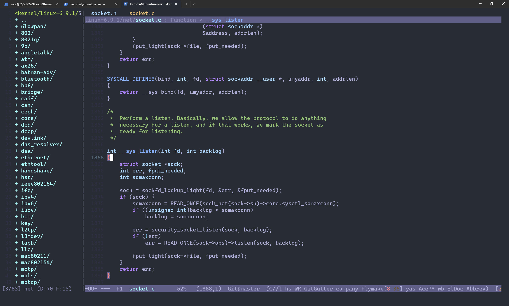

# Linux 内核编译

这篇文章的目的是为了快速整理一个看内核部分代码的环境，不涉及调试和条件编译。

## 下载地址

> 内核官网： https://www.kernel.org/
>
> 清华镜像：https://mirror.bjtu.edu.cn/kernel/linux/kernel/

## 简单编译

```bash
# 下载 6.9.1 版本内核
$ wget https://mirrors.tuna.tsinghua.edu.cn/kernel/v6.x/linux-6.9.1.tar.xz
# 安装依赖库
$ sudo apt install git fakeroot build-essential ncurses-dev xz-utils libssl-dev bc flex libelf-dev bison qemu qemu-system qemu-kvm
# 解压
$ tar -xf linux-6.9.1.tar.xz
$ cd linux-6.9.1/
# 生成默认配置
$ make defconfig
# 编译并生成 compile_commands.json 用于 clangd 进行代码分析和跳转
# 如果不需要则去掉 `bear --`
$ bear -- make -j $(nproc) bzImage
```

完成编译之后就可以使用 Emacs 等编辑器查看代码并且支持跳转了。



