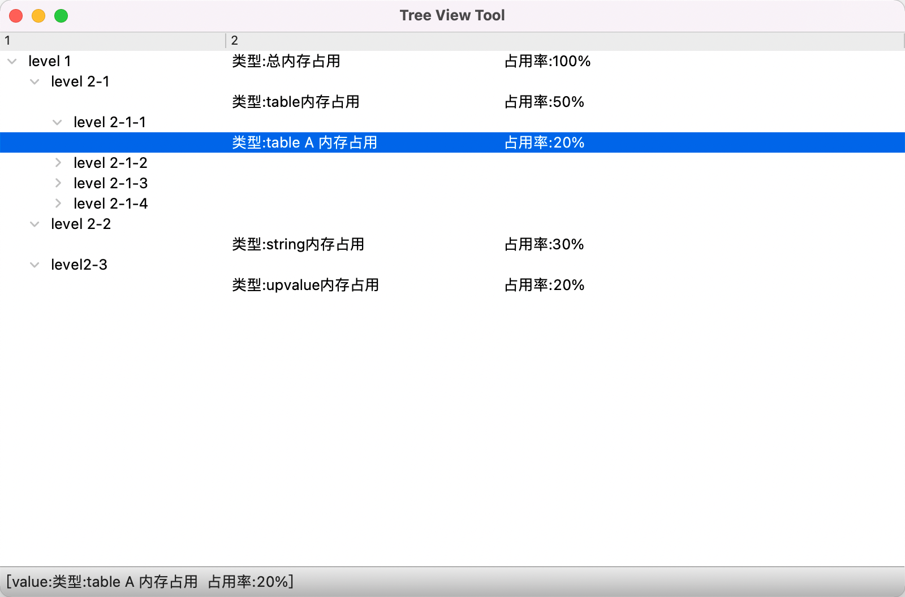

# PyQt5 树形图例子

这个程序是为了用 Python 实现一个可视化的 Tree 层级结构。使用场景包括用于对程序的资源使用进行可视化。

主要使用 PyQt5 的 QTreeView 进行实现。

## 代码

```python
import sys
from PyQt5.QtGui import QStandardItemModel, QStandardItem
from PyQt5.QtWidgets import (
    QApplication,
    QMainWindow,
    QTreeView,
    QStyleFactory,
)

# 测试数据
m = {
    "level": {
        "name": "level 1",
        "key": "总内存占用",
        "value": "100%",
        "items": [
            {
                "name": "level 2-1",
                "key": "table内存占用",
                "value": "50%",
                "items": [
                    {
                        "name": "level 2-1-1",
                        "key": "table A 内存占用",
                        "value": "20%",
                        "items": [],
                    },
                    {
                        "name": "level 2-1-2",
                        "key": "table B 内存占用",
                        "value": "10%",
                        "items": [],
                    },
                    {
                        "name": "level 2-1-3",
                        "key": "table C 内存占用",
                        "value": "10%",
                        "items": [],
                    },
                    {
                        "name": "level 2-1-4",
                        "key": "table D 内存占用",
                        "value": "10%",
                        "items": [],
                    },
                ],
            },
            {
                "name": "level 2-2",
                "key": "string内存占用",
                "value": "30%",
                "items": [],
            },
            {
                "name": "level2-3",
                "key": "upvalue内存占用",
                "value": "20%",
                "items": [],
            },
        ],
    }
}

class TreeView(QMainWindow):
    def __init__(self) -> None:
        super(TreeView, self).__init__()

        self.setWindowTitle("Tree View Tool")
        self.resize(800, 500)
        self.initUI()

    def initUI(self):
        model = QStandardItemModel(self)

        # add items
        m2 = m["level"]
        item = QStandardItem(m2["name"])
        model.appendRow(item)
        model.setItem(
            0, 1, QStandardItem("类型:{}\t\t占用率:{}".format(m2["key"], m2["value"]))
        )
        for subItem in m2["items"]:
            self.addSubItem(item, subItem)

        treeView = QTreeView(self)
        treeView.setModel(model)

        treeView.header().resizeSection(0, 200)
        treeView.setStyle(QStyleFactory.create("window"))
        # 默认全部展开
        # treeView.expandAll()

        # 提示栏显示选中行的信息
        treeView.selectionModel().currentChanged.connect(self.ShowCurrentItem)

        self.setCentralWidget(treeView)

    def addSubItem(self, parentItem, m):
        item = QStandardItem(m["name"])
        parentItem.appendRow(item)
        item.setChild(
            0, 1, QStandardItem("类型:{}\t\t占用率:{}".format(m["key"], m["value"]))
        )

        for subItem in m["items"]:
            self.addSubItem(item, subItem)

    def ShowCurrentItem(self, current):
        text = "[value:{}]".format(current.data())
        self.statusBar().showMessage(text)

if __name__ == "__main__":
    app = QApplication(sys.argv)
    window = TreeView()
    window.show()
    sys.exit(app.exec())
```

## 效果


