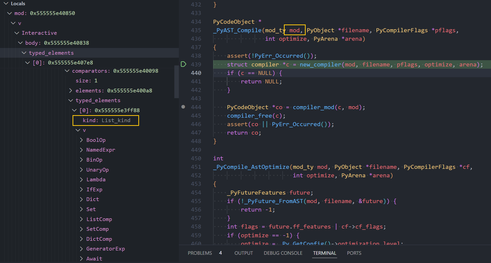
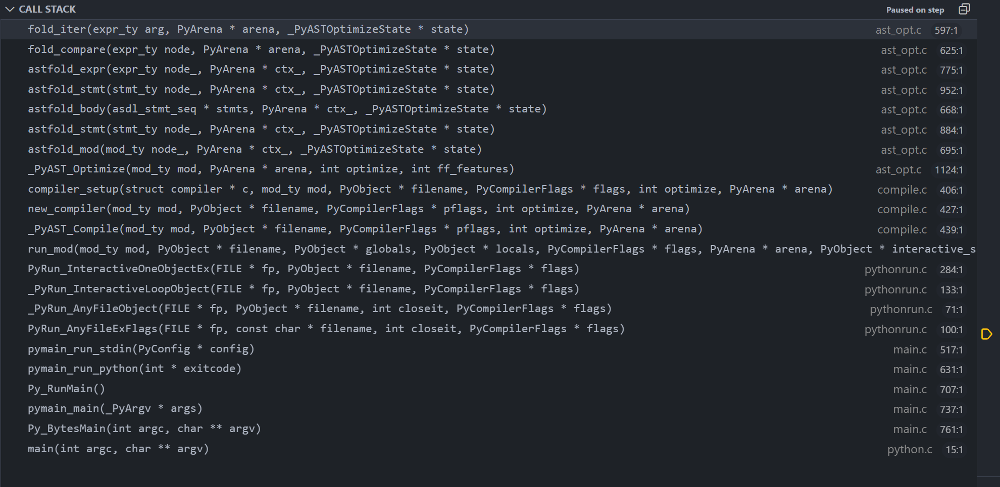

# Python 的 `if in` 结构对列表的优化

这一篇文章讨论一下 cpython 的实现中对于 `if obj in [x, y, z, ..]` 这种结构的优化。
首先看下面的三个函数。

```python
>>> def f1():
...     if 1 in (1,2,3):
...         pass
...
>>> def f2():
...     if 1 in [1,2,3]:
...         pass
...
>>> def f3():
...     a = [1,2,3]
...     if 1 in a:
...         pass
```

这是它们对应的字节码。

```python
>>> dis(f1)
  2           0 LOAD_CONST               1 (1)
              2 LOAD_CONST               2 ((1, 2, 3))
              4 CONTAINS_OP              0
              6 POP_JUMP_IF_FALSE        7 (to 14)

  3           8 NOP
             10 LOAD_CONST               0 (None)
             12 RETURN_VALUE

  2     >>   14 LOAD_CONST               0 (None)
             16 RETURN_VALUE
>>>
>>> dis(f2)
  2           0 LOAD_CONST               1 (1)
              2 LOAD_CONST               2 ((1, 2, 3))
              4 CONTAINS_OP              0
              6 POP_JUMP_IF_FALSE        7 (to 14)

  3           8 NOP
             10 LOAD_CONST               0 (None)
             12 RETURN_VALUE

  2     >>   14 LOAD_CONST               0 (None)
             16 RETURN_VALUE
>>>
>>> dis(f3)
  2           0 BUILD_LIST               0
              2 LOAD_CONST               1 ((1, 2, 3))
              4 LIST_EXTEND              1
              6 STORE_FAST               0 (a)

  3           8 LOAD_CONST               2 (1)
             10 LOAD_FAST                0 (a)
             12 CONTAINS_OP              0
             14 POP_JUMP_IF_FALSE       11 (to 22)

  4          16 NOP
             18 LOAD_CONST               0 (None)
             20 RETURN_VALUE

  3     >>   22 LOAD_CONST               0 (None)
             24 RETURN_VALUE
```

从字节码中可以很清晰的看到函数 `f1` 和函数 `f2` 的字节码完全一样。
`f1` 中使用字节码 `LOAD_CONST` 加载源码中的 `(1, 2, 3)`,
`f2` 中同样使用字节码 `LOAD_CONST` 加载源码中的 `[1, 2, 3]`。
因为 Python 中 `List` 构造要比 `Tuple` 的构造更加复杂，所以这里
可以认为是 cpython 将 `f2` 中的 `[1, 2, 3]` 优化为了 `(1, 2, 3)`。

也将以将函数 `f2` 与 `f3` 的字节码进行比较，`f3` 中的字节码比较循规蹈矩，
先是构造一个空 `List`，然后构造一个 `Tuple (1, 2, 3)`，再利用这个 `Tuple`
将 `List` 拓展成 `List [1, 2, 3]`。

看到这里我们可以理解 cpython 对 `if .. in [..]` 的优化应该是处于性能的考虑，
毕竟对于大多数 cpython 程序来说，重新编译字节码的次数要远小于这行字节码运行的次数。
我想探究的问题是这个优化发生于 cpython 编译字节码的什么具体哪个步骤中。在 cpython 中，
源代码到字节码的流程大致有如下步骤：

1. 源代码解析成 Token，也称为词法分析。
2. 将 Token 构造成一个 AST，称为语法分析。
3. AST 优化。
4. AST 编译为字节码。

可以做出合理猜测，上面的优化发生在第三个步骤——AST 优化中。接下来就是验证这个猜测的过程。
有了大致的方向，需要梳理一下验证工作的步骤。这里我的步骤如下：

1. 找到步骤四的开始代码，验证 AST 的结构是否是已经被优化过的。
如果是，则优化发生在前三步， 否则是由步骤四的字节码生成器完成的。
2. 找到步骤三的开始代码，验证 AST 的结构是否未被优化。
如果是，则优化发生后在第三步，否则发生在前两步。

如果对 cpython 比较熟悉，可以快速找到 编译 AST 到字节码的位置。

```c
PyCodeObject *
_PyAST_Compile(mod_ty mod, PyObject *filename, PyCompilerFlags *pflags,
               int optimize, PyArena *arena)
{
    assert(!PyErr_Occurred());
    struct compiler *c = new_compiler(mod, filename, pflags, optimize, arena);
    if (c == NULL) {
        return NULL;
    }

    PyCodeObject *co = compiler_mod(c, mod);
    compiler_free(c);
    assert(co || PyErr_Occurred());
    return co;
}
```

参数 `mod` 就是步骤二生成的 AST。上面代码中两个函数调用比较重要， `new_compiler` 负责优化 AST，
`compiler_mod` 负责将 AST 编译为字节码。按照验证猜想的步骤，可以在这两个函数的前面分别打上断点，
看一下对应的 AST。**这里插入一个小知识：使用 cpython 3.13 之前的标准库的 `ast` 模块获得的 AST 是没有被优化的，具体看文章中后面的专题小节**。
cpython 的 C 代码中我没有发现有提供打印 AST 的调试函数， 所以这里看 AST 的办法只能是通过 GDB 或者其他调试手段。
用 VSCode 会方便些，基本就是断点到对应位置，然后看结构了，之后看是否有空写一个 GDB 调试脚本，用类似 `ast` 模块的方式打印 AST。



调试这个函数之后，可以发现调用 `new_compiler` 前后对应的节点从 `List_kind` 变为了 `Tuple_kind`。
接着调试 `new_compiler` 函数内部，可以追踪到 `fold_compare` 函数，里面的注释清晰的指明了这个优化。
而 `List` 变 `Tuple` 的过程则发生在 `fold_iter` 函数中。

```c
static int
fold_compare(expr_ty node, PyArena *arena, _PyASTOptimizeState *state)
{
    asdl_int_seq *ops;
    asdl_expr_seq *args;
    Py_ssize_t i;

    ops = node->v.Compare.ops;
    args = node->v.Compare.comparators;
    /* Change literal list or set in 'in' or 'not in' into
       tuple or frozenset respectively. */
    i = asdl_seq_LEN(ops) - 1;
    int op = asdl_seq_GET(ops, i);
    if (op == In || op == NotIn) {
        if (!fold_iter((expr_ty)asdl_seq_GET(args, i), arena, state)) {
            return 0;
        }
    }
    return 1;
}

static int
fold_iter(expr_ty arg, PyArena *arena, _PyASTOptimizeState *state)
{
    PyObject *newval;
    if (arg->kind == List_kind) {
        /* First change a list into tuple. */
        asdl_expr_seq *elts = arg->v.List.elts;
        if (has_starred(elts)) {
            return 1;
        }
        expr_context_ty ctx = arg->v.List.ctx;
        arg->kind = Tuple_kind;
        arg->v.Tuple.elts = elts;
        arg->v.Tuple.ctx = ctx;
        /* Try to create a constant tuple. */
        newval = make_const_tuple(elts);
    }
    else if (arg->kind == Set_kind) {
        newval = make_const_tuple(arg->v.Set.elts);
        if (newval) {
            Py_SETREF(newval, PyFrozenSet_New(newval));
        }
    }
    else {
        return 1;
    }
    return make_const(arg, newval, arena);
}
```

完整的堆栈图如下，调试使用的 cpython 代码版本为 `3.13.0a6+ heads/main:b6c62c79e7`



## 打印代码的 AST

在 cpython 3.13 之前，使用标准库的 `ast` 模块获得的 AST 是没有被优化的。可以看这个代码例子。

```python
import ast
import inspect

def f():
    if 5 in[1,2,3]:
        pass

code = inspect.getsource(f)
tree = ast.parse(code)
print(ast.dump(tree, indent=4))
```

这段代码的输出如下，可以看到 List 并未被优化为 Tuple。

```sh
Module(
    body=[
        FunctionDef(
            name='f',
            args=arguments(
                posonlyargs=[],
                args=[],
                kwonlyargs=[],
                kw_defaults=[],
                defaults=[]),
            body=[
                If(
                    test=Compare(
                        left=Constant(value=5),
                        ops=[
                            In()],
                        comparators=[
                            List(
                                elts=[
                                    Constant(value=1),
                                    Constant(value=2),
                                    Constant(value=3)],
                                ctx=Load())]),
                    body=[
                        Pass()],
                    orelse=[])],
            decorator_list=[])],
    type_ignores=[])
```

在 cpython 3.13 之后，`ast` 模块的 `ast.parse` 函数增加了一个 `optimize` 参数，设置为大于 0 的值可以获取优化后的 AST。

```python
def parse(source, filename='<unknown>', mode='exec', *,
          type_comments=False, feature_version=None, optimize=-1):
    """
    Parse the source into an AST node.
    Equivalent to compile(source, filename, mode, PyCF_ONLY_AST).
    Pass type_comments=True to get back type comments where the syntax allows.
    """
    flags = PyCF_ONLY_AST
    if optimize > 0:
        flags |= PyCF_OPTIMIZED_AST
    if type_comments:
        flags |= PyCF_TYPE_COMMENTS
    if feature_version is None:
        feature_version = -1
    elif isinstance(feature_version, tuple):
        major, minor = feature_version  # Should be a 2-tuple.
        if major != 3:
            raise ValueError(f"Unsupported major version: {major}")
        feature_version = minor
    # Else it should be an int giving the minor version for 3.x.
    return compile(source, filename, mode, flags,
                   _feature_version=feature_version, optimize=optimize)
```

仍然使用上面的代码，看一下优化后的 AST 如何。

```python
import ast
import inspect

def f():
    if 5 in[1,2,3]:
        pass

code = inspect.getsource(f)
tree = ast.parse(code, optimize=1)
print(ast.dump(tree, indent=4))
```

输出中可以看到 `List` 被优化成了 `Constant`：

```sh
Module(
    body=[
        FunctionDef(
            name='f',
            args=arguments(
                posonlyargs=[],
                args=[],
                kwonlyargs=[],
                kw_defaults=[],
                defaults=[]),
            body=[
                If(
                    test=Compare(
                        left=Constant(value=5),
                        ops=[
                            In()],
                        comparators=[
                            Constant(value=(1, 2, 3))]),
                    body=[
                        Pass()],
                    orelse=[])],
            decorator_list=[],
            type_params=[])],
    type_ignores=[])
```

