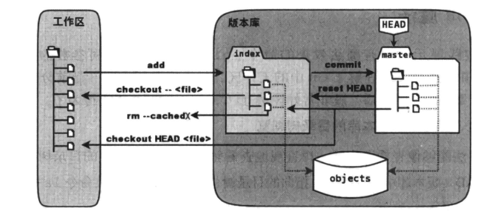

# git 技巧


## 修改 git 的默认编辑器

```bash
git config core.editor vim
```

将 git 的默认编辑器修改为 vim。


## 将 git 部分命令的输出中的中文从八进制改成中文

针对部分命令如 `git log`  `git status` 中含中文的路径名会以八进制显示的情况，可以进行如下设置，让 git 以中文显示路径。

```bash
git config --global core.quotepath false
```


## 按条件查看提交历史

[2.3 Git 基础 - 查看提交历史](https://git-scm.com/book/zh/v2/Git-%E5%9F%BA%E7%A1%80-%E6%9F%A5%E7%9C%8B%E6%8F%90%E4%BA%A4%E5%8E%86%E5%8F%B2)

查看提交历史使用的命令是 `git log`。下面介绍几个常用的选项。

```bash
git log -2 # 输出最近的两次提交
git log -p 2 # 按 patch 格式输出最近的两次提交
git log --since 2021-01-01 # 输出 2021-01-01 之后的提交
git log --until 2021-01-01 # 输出最晚到 2021-01-01 的提交
git log --author carl  # 输出作者字符串中包含 "carl" 的提交
git log --committer carl # 输出提交者字符串中包含 "carl" 的提交
git log --grep carl # 输出提交说明中包含 "carl" 的提交
git log -S carl # 输出提交的内容中添加或删除了该字符串的提交，例如可以用来查看函数的改动
```


## 重写提交说明

当执行了 `git commit "some message"` 命令之后发现提交的 "some message"  存在问题，需要修改，可以下列操作来修改提交信息。

如果要修改的是**最近一次** `git commit` 的提交信息，使用如下修补提交的命令。

```bash
git commit --amend
```

执行这条命令后就会打开一个 Nano 的编辑窗口，然后就可以修改上一次的提交信息了。

如果不想打开 Nano，可以使用 `-m` 参数加上新的提交信息。

```bash
git commit --amend -m "new commit message"
```

如果需要修改的是历史提交信息（即不是最近一次提交信息）的话，就需要使用 `git rebase` 命令，下面是一个完整的例子。

```bash
➜ mkdir test1
➜ cd test1/
➜ git init
Initialized empty Git repository in /home/lzh/test/git/test1/.git/
➜ touch a.txt
➜ git add -A
➜ git commit -m "create a.txt"
[master (root-commit) 39d83ee] create a.txt
 1 file changed, 0 insertions(+), 0 deletions(-)
 create mode 100644 a.txt
➜ touch b.txt
➜ git add -A
➜ git commit -m "create b.txt"
[master 8958708] create b.txt
 1 file changed, 0 insertions(+), 0 deletions(-)
 create mode 100644 b.txt
➜ git log
commit 895870830338c9fcd3700fe0c4da98747ef6fd7b (HEAD -> master)
Author: LiuYinCarl <bearcarl@qq.com>
Date:   Wed Oct 20 20:50:53 2021 +0800

    create b.txt

commit 39d83eec2dc0aa84bc5b921b4c81524c29345504
Author: LiuYinCarl <bearcarl@qq.com>
Date:   Wed Oct 20 20:50:30 2021 +0800

    create a.txt
```

`git rebase -i` 后接的参数如果是 `--root` 表示从第一个提交记录开始查看。如果是一个提交记录的散列值，比如 `39d83eec2dc0aa84bc5b921b4c81524c29345504` 则表示从该提交记录开始查看，不包含这个提交。

这是是 执行 `rebase` 命令后打开的文件。从上到下一次是我们的提交记录。

```bash
pick 39d83ee create a.txt
pick 8958708 create b.txt

# Rebase 8958708 onto 009e0bc (2 commands)
#
# Commands:
# p, pick <commit> = use commit
# r, reword <commit> = use commit, but edit the commit message
# e, edit <commit> = use commit, but stop for amending
# s, squash <commit> = use commit, but meld into previous commit
# f, fixup <commit> = like "squash", but discard this commit's log message
# x, exec <command> = run command (the rest of the line) using shell
# b, break = stop here (continue rebase later with 'git rebase --continue')
# d, drop <commit> = remove commit
# l, label <label> = label current HEAD with a name
# t, reset <label> = reset HEAD to a label
# m, merge [-C <commit> | -c <commit>] <label> [# <oneline>]
# .       create a merge commit using the original merge commit's
# .       message (or the oneline, if no original merge commit was
# .       specified). Use -c <commit> to reword the commit message.
#
# These lines can be re-ordered; they are executed from top to bottom.
#
# If you remove a line here THAT COMMIT WILL BE LOST.
#
# However, if you remove everything, the rebase will be aborted.
#
# Note that empty commits are commented out
```

根据命令提示，修改成下面这个样子, 第一行改成 r，表示我们要修改这次历史提交的提交信息。

```bash
r 39d83ee create a.txt
pick 8958708 create b.txt

# Rebase 8958708 onto 009e0bc (2 commands)
# 未修改部分，省略 ...
```

保存退出后，git 会自动打开另一个编辑页面，让你编辑这次历史提交的提交信息，内容如下

```bash
create a.txt

# Please enter the commit message for your changes. Lines starting
# with '#' will be ignored, and an empty message aborts the commit.
#
# Date:      Wed Oct 20 20:50:30 2021 +0800
#
# interactive rebase in progress; onto 009e0bc
# Last command done (1 command done):
#    r 39d83ee create a.txt
# Next command to do (1 remaining command):
#    pick 8958708 create b.txt
# You are currently editing a commit while rebasing branch 'master' on '009e0bc'.
#
#
# Initial commit
#
# Changes to be committed:
#       new file:   a.txt
#
```

最上面一行就是我们之前的提交信息，现在将它改成下面这个样子

```bash
create rebase commit

# 未修改部分，省略 ...

```

保存退出

```bash
➜ git rebase -i --root
[detached HEAD 1c19a3b] create rebase commit
 Date: Wed Oct 20 20:50:30 2021 +0800
 1 file changed, 0 insertions(+), 0 deletions(-)
 create mode 100644 a.txt
Successfully rebased and updated refs/heads/master.
➜ git log
commit c771c4b14d78f6779cb6b77615562cf8ea65206d (HEAD -> master)
Author: LiuYinCarl <bearcarl@qq.com>
Date:   Wed Oct 20 20:50:53 2021 +0800

    create b.txt

commit 1c19a3b8a5d60b6af9b8c87a6ac1aeecaac65727
Author: LiuYinCarl <bearcarl@qq.com>
Date:   Wed Oct 20 20:50:30 2021 +0800

    create rebase commit
```

通过 `git log` 命令可以看到第一次提交的 commit 信息发生了变化。


## 去除错误提交的文件

如果是要删除最近一次提交的话，可以使用 `git rm` 和 `git commit` 命令。

```bash
➜ mkdir testrm
➜ cd testrm/
➜ git init
Initialized empty Git repository in /Users/zhl/dev/test/git/testrm/.git/
➜ touch a.txt b.txt
➜ git add -A
➜ git commit -m "add two file"
[master (root-commit) 01a8038] add two file
 Committer: ZH L <zhl@ZHdeMacBook-Air.local>
 2 files changed, 0 insertions(+), 0 deletions(-)
 create mode 100644 a.txt
 create mode 100644 b.txt
➜ git log -p
commit 01a80384a8c60881d9ffb72b9f4cada684468474 (HEAD -> master)
Author: ZH L <zhl@ZHdeMacBook-Air.local>
Date:   Sat Oct 23 00:55:35 2021 +0800

    add two file

diff --git a/a.txt b/a.txt
new file mode 100644
index 0000000..e69de29
diff --git a/b.txt b/b.txt
new file mode 100644
index 0000000..e69de29
➜ git rm --cached a.txt
rm 'a.txt'
➜ git commit --amend
[master ca0da34] add two file
 Date: Sat Oct 23 00:55:35 2021 +0800
 Committer: ZH L <zhl@ZHdeMacBook-Air.local>
 1 file changed, 0 insertions(+), 0 deletions(-)
 create mode 100644 b.txt
➜ git log -p
commit ca0da344170a84afe1f5ecfe3b01223db536613f (HEAD -> master)
Author: ZH L <zhl@ZHdeMacBook-Air.local>
Date:   Sat Oct 23 00:55:35 2021 +0800

    add two file

diff --git a/b.txt b/b.txt
new file mode 100644
index 0000000..e69de29
```

可以看到，使用 `git rm --cached a.txt` 和 `git commit --amend` 后成功地从提交记录中删除了之前提交的 `a.txt` 文件。

如果需要修改文件的不是最近一次提交，而是历史提交记录，则需要使用 `rebase` 操作。

 ```bash
 ➜ mkdir test
 ➜ cd test/
 ➜ git init
 Initialized empty Git repository in /Users/zhl/dev/test/git/test/.git/
 ➜ touch a.txt b.txt
 ➜ git add -A
 ➜ git commit -m "add a.txt b.txt"
 [main (root-commit) 9a4b1c4] add a.txt b.txt
  2 files changed, 0 insertions(+), 0 deletions(-)
  create mode 100644 a.txt
  create mode 100644 b.txt
 ➜ touch c.txt
 ➜ git add -A
 ➜ git commit -m "add c.txt"
 [main 82f1a7c] add c.txt
  1 file changed, 0 insertions(+), 0 deletions(-)
  create mode 100644 c.txt
 ➜  test git:(main) git log
 commit 82f1a7c929007fbc175d2164f700ca46a324c45c (HEAD -> main)
 Author: LiuYinCarl <1427518212@qq.com>
 Date:   Sat Oct 23 01:23:36 2021 +0800
 
     add c.txt
 
 commit 9a4b1c4bd21c963722cfd29aefb9e95fa3f054bf
 Author: LiuYinCarl <1427518212@qq.com>
 Date:   Sat Oct 23 01:23:05 2021 +0800
 
     add a.txt b.txt
 ➜  test git:(main) git rebase -i --root
 ```

执行 `git rebase` 后，会打开一个文件，内容如下（省略操作提示行）

```bash
pick 9a4b1c4 add a.txt b.txt
pick 82f1a7c add c.txt
```

根据提示，使用 `edit` 命令将提交记录修改为如下

```bash
edit 9a4b1c4 add a.txt b.txt
pick 82f1a7c add c.txt
```

然后继续在终端执行如下命令

```bash
➜ git rebase -i --root
Stopped at 9a4b1c4...  add a.txt b.txt
You can amend the commit now, with

  git commit --amend

Once you are satisfied with your changes, run

  git rebase --continue
➜ git rm --cached a.txt
rm 'a.txt'
➜ git commit --amend -m "add b.txt"
[detached HEAD 4729a73] add b.txt
 Date: Sat Oct 23 01:23:05 2021 +0800
 1 file changed, 0 insertions(+), 0 deletions(-)
 create mode 100644 b.txt
➜ git rebase --continue
Successfully rebased and updated refs/heads/main.
➜ git log
commit 4f59d2381da0f791649d413718fd1c81f5248da0 (HEAD -> main)
Author: LiuYinCarl <1427518212@qq.com>
Date:   Sat Oct 23 01:23:36 2021 +0800

    add c.txt

commit 4729a73942ef9be65953d9f1e0148b6979528b85
Author: LiuYinCarl <1427518212@qq.com>
Date:   Sat Oct 23 01:23:05 2021 +0800

    add b.txt
```

可以看到，提交记录已经发生了变化，原先错误提交的 `a.txt` 也被从提交记录中去除了。

## git 暂存区的概念

可以通过 `git add` 命令将文件存入 git 暂存区。

存入到了 git 暂存区中的文件在没有再次修改之前不会在 `git diff` 的输出中出现。如果存入了暂存区之后再次修改了这个文件，那么 `git diff` 的输出也只会展示存入了暂存区后的修改内容。

## git 按单词进行差异比较

git 默认是基于行进行差异比较的。如果我们想要看基于单词的比较的话，可以使用如下命令。

```bash
git diff --word-diff
```

但是这样不能看到暂存区中的变更，如果想看到添加到暂存区中的文件的变更，可以使用如下命令。

```bash
git diff --cached --word-diff
```

下面是一个具体的例子。

```bash
➜ mkdir test
➜ cd test/
➜ git init
Initialized empty Git repository in /Users/zhl/dev/test/git/test/.git/
➜ touch a.txt
➜ echo "when where how" > a.txt
➜ git add a.txt
➜ git diff
➜ echo "when you how" > a.txt
➜ git add a.txt
➜ git diff # 存入暂存区后，看不到差异
➜ echo "when you me" > a.txt
➜ git diff --word-diff
diff --git a/a.txt b/a.txt
index 9d4e288..0ad843e 100644
--- a/a.txt
+++ b/a.txt
@@ -1 +1 @@
when you [-how-]{+me+}
➜ git diff --cached --word-diff # 使用 --cached 可以看到暂存区中的差异了
diff --git a/a.txt b/a.txt
new file mode 100644
index 0000000..9d4e288
--- /dev/null
+++ b/a.txt
@@ -0,0 +1 @@
{+when you how+}
```


## 用 git stash 临时保存进度

 在开发一个功能开发到一半的过程中需要紧急处理另一个 bug 的时候，需要将未开发完成的功能临时进程保存，恢复一个没有修改的工作区，或者切换到其他分支进行 bug 修复。

下面是一个具体的例子。

```bash
➜ mkdir test
➜ cd test/
➜ git init
Initialized empty Git repository in /Users/zhl/dev/test/git/test/.git/
➜ echo "when where how" > a.txt # 创建一个有一行的文件
➜ git add -A
➜ git commit -m "add a.txt" # 提交这个文件
[main (root-commit) 5912fc5] add a.txt
 1 file changed, 1 insertion(+)
 create mode 100644 a.txt
➜ echo "when you how" > a.txt # 修改第一行，模拟开发一个功能到一半
➜ git stash # 处理其他bug,将未完成的功能的修改暂存
Saved working directory and index state WIP on main: 5912fc5 add a.txt
➜ git status # 查看状态，发现修改被暂存，工作区变干净了
On branch main
nothing to commit, working tree clean
➜ echo "add line 2" >> a.txt # 添加第二行，模拟修复bug
➜ cat a.txt
when where how
add line 2
➜ git add -A
➜ git commit -m "add line 2" # 提交bug修复代码
[main 76f297c] add line 2
 1 file changed, 1 insertion(+)
➜ git stash pop # 将暂存的文件取出，发现出现了冲突
Auto-merging a.txt
CONFLICT (content): Merge conflict in a.txt
The stash entry is kept in case you need it again.
➜ cat a.txt # 查看冲突
<<<<<<< Updated upstream
when where how
add line 2
=======
when you how
>>>>>>> Stashed changes
➜  test git:(main) ✗ emacs a.txt # 手动合并冲突
➜  test git:(main) ✗ git stash drop # 删除最近的一个 stash
Dropped refs/stash@{0} (5d47bf44053352dc2546e7df39a39440b641eab9)
➜  test git:(main) ✗ git add -A # 将之前开发的部分功能加到暂存区
➜  test git:(main) ✗ em a.txt # 将第一行改成 "when you me",模拟继续开发功能
➜  test git:(main) ✗ git diff
diff --git a/a.txt b/a.txt
index 97f50a5..13fef9d 100644
--- a/a.txt
+++ b/a.txt
@@ -1,2 +1,2 @@
-when you how
+when you me
 add line 2
➜ git add -A
➜ git commit -m "modify line 1" # 提交开发完成的功能
[main 4b97569] modify line 1
 1 file changed, 1 insertion(+), 1 deletion(-)
➜ git log
commit 4b975698536fea6b2b66bc0e4fe0675097711875 (HEAD -> main)
Author: LiuYinCarl <1427518212@qq.com>
Date:   Sun Oct 24 21:23:02 2021 +0800

    modify line 1

commit 76f297c168d0d2e4fdcfd041e793509333774be6
Author: LiuYinCarl <1427518212@qq.com>
Date:   Sun Oct 24 21:15:05 2021 +0800

    add line 2

commit 5912fc5d54f9970127e862d394903aa2d99c3fa1
Author: LiuYinCarl <1427518212@qq.com>
Date:   Sun Oct 24 21:13:24 2021 +0800

    add a.txt
➜ cat a.txt # 查看内容
when you me
add line 2
```


## git 的配置文件

git 有三个优先级不同的配置文件。

- 项目级别的配置文件，在项目的  `.git/config` 位置
- 用户级别的配置文件，在 `~/.gitconfig` 位置
- 系统级别的配置文件，在 `/etc/gitconfig` 位置

三个配置文件的优先级依次降低。

- 进行项目级别的配置，使用的命令是 `git config`。

- 进行用户级别的配置，使用的命令是 `git config --global`。

- 进行系统级别的配置，使用的命令是 `git config --system`。


## 修改错误的提交者信息

有些时候，如果没有设置项目的作者就进行了提交，会导致提交者信息出现错误，所以 git 提供了命令来进行提交者信息的修改。

下面是一个修改最近一次提交的 author 信息的例子。

```bash
➜ git init test
Initialized empty Git repository in /Users/zhl/dev/test/git/test/.git/
➜ cd test/
# 配置一个错误的 author 信息
➜ git config user.name "wrong name"
➜ git config user.email "wrong email"
➜ touch a.txt
➜ git add -A
➜ git commit -m "commit by wrong author info"
[main (root-commit) ba2de4c] commit by wrong author info
 1 file changed, 0 insertions(+), 0 deletions(-)
 create mode 100644 a.txt
➜ git log # 查看提交记录，发现 author 信息错误
commit ba2de4c567cf2696bdf6be0719ff6b6e02646422 (HEAD -> main)
Author: wrong name <wrong email>
Date:   Mon Oct 25 05:38:27 2021 +0800

    commit by wrong author info
# 配置正确的 author 信息
➜ git config user.name "right name"
➜ git config user.email "right email"
# 使用 --amend --reset-author 重制最近一次提交的 author 信息
➜ git commit --amend --reset-author
[main 78b6b11] commit by right author info
 1 file changed, 0 insertions(+), 0 deletions(-)
 create mode 100644 a.txt
➜  test git:(main) git log
commit 78b6b11363a58319111e259118e8f66ef3a3101a (HEAD -> main)
Author: right name <right email>
Date:   Mon Oct 25 05:39:16 2021 +0800

    commit by right author info
```


## git diff 的几个参数说明

对于一个 git 仓库某个分支中的文件，最多会有三个不同的版本(不考虑 git stash)：版本库中的版本，暂存区 stage 中的版本，工作区中的版本。

`git diff` 比较的是工作区和暂存区的差异。`git diff HEAD` 比较的是工作区和版本库当前分支的差异。`git diff --cache` 或者 `git diff --staged`比较的是暂存区 stage 和版本库当前分支的差异。


## 工作区，版本库，暂存区关系示意图

图源：Git权威指南 图5-1 蒋鑫著



## 浏览工作区，暂存区，版本库的目录树

查看当前版本库的目录树可以使用命令

```bash
git ls-tree -lr HEAD
```

`git ls-tree` 可使用的参数如下

```bash
usage: git ls-tree [<options>] <tree-ish> [<path>...]

    -d                    only show trees
    -r                    recurse into subtrees
    -t                    show trees when recursing
    -z                    terminate entries with NUL byte
    -l, --long            include object size
    --name-only           list only filenames
    --name-status         list only filenames
    --full-name           use full path names
    --full-tree           list entire tree; not just current directory (implies --full-name)
    --abbrev[=<n>]        use <n> digits to display SHA-1s
```

查看暂存区的目录树可以使用命令 `git ls-files`

```bash
git ls-files -s
```

## git reset 常见用法

下面列举一些 `git reset` 的常见用法和说明。

```bash
# 替换 HEAD 的指向变为 commitid, 并修改暂存区和工作区，使得内容与 HEAD 一致
git reset --hard commitid

# 替换 HEAD 的指向变为 commitid, 不修改暂存区和工作区
git reset --soft commitid

# 替换 HEAD 的指向变为 commitid, 修改暂存区，使得内容与 HEAD 一致，但是不修改工作区
git reset commitid
git reset --mixed commited

# 将文件 file 的改动从暂存区去除, 注意 -- 和文件名之间有空格
git reset -- file
```


## 错误使用了 git reset 后如何恢复

master 分支的变更文件保存在 `.git/logs/refs/heads/master` 中，通知通过查看该文件了解分支 HEAD 的变化，最新的变化放在最上面。

下面的例子先创建三个提交记录，然后执行 `git reset --hard` 命令丢弃最近的一个提交记录，最后使用 `git reflog` 协助找回最后的提交记录。

```bash
➜ git init test
Initialized empty Git repository in /home/lzh/test/git/test/.git/
➜ cd test/
➜ touch a.txt
➜ git add -A
➜ git commit -m "a.txt"
[master (root-commit) 0d1d1db] a.txt
 1 file changed, 0 insertions(+), 0 deletions(-)
 create mode 100644 a.txt
➜ touch b.txt
➜ git add -A
➜ git commit -m "b.txt"
[master 07f700a] b.txt
 1 file changed, 0 insertions(+), 0 deletions(-)
 create mode 100644 b.txt
➜ touch c.txt
➜ git add -A
➜ git commit -m "c.txt"
[master 07b75df] c.txt
 1 file changed, 0 insertions(+), 0 deletions(-)
 create mode 100644 c.txt
➜ ls
a.txt  b.txt  c.txt
➜ git log
commit 07b75df1e74cb38ca6433deafcc9a1cf453a4a2e (HEAD -> master)
Author: LiuYinCarl <bearcarl@qq.com>
Date:   Mon Oct 25 17:30:13 2021 +0800

    c.txt

commit 07f700adba787eada6fc3057d633aaa435500f73
Author: LiuYinCarl <bearcarl@qq.com>
Date:   Mon Oct 25 17:29:57 2021 +0800

    b.txt

commit 0d1d1db59bc26063dc792b19a0e7af5688719e14
Author: LiuYinCarl <bearcarl@qq.com>
Date:   Mon Oct 25 17:29:39 2021 +0800

    a.txt
➜ git reset --hard 07f700adba # 丢弃最近一个提交记录
HEAD is now at 07f700a b.txt
➜ git log
commit 07f700adba787eada6fc3057d633aaa435500f73 (HEAD -> master)
Author: LiuYinCarl <bearcarl@qq.com>
Date:   Mon Oct 25 17:29:57 2021 +0800

    b.txt

commit 0d1d1db59bc26063dc792b19a0e7af5688719e14
Author: LiuYinCarl <bearcarl@qq.com>
Date:   Mon Oct 25 17:29:39 2021 +0800

    a.txt
➜ git reflog show master | head -5 # 查看最近 5 次 master 的 HEAD 变更
07f700a master@{0}: reset: moving to 07f700adba
07b75df master@{1}: commit: c.txt
07f700a master@{2}: commit: b.txt
0d1d1db master@{3}: commit (initial): a.txt
➜ git reset --hard master@{1}  # 将 master 的 HEAD 恢复到最近的一次提交
HEAD is now at 07b75df c.txt
➜ git log
commit 07b75df1e74cb38ca6433deafcc9a1cf453a4a2e (HEAD -> master)
Author: LiuYinCarl <bearcarl@qq.com>
Date:   Mon Oct 25 17:30:13 2021 +0800

    c.txt

commit 07f700adba787eada6fc3057d633aaa435500f73
Author: LiuYinCarl <bearcarl@qq.com>
Date:   Mon Oct 25 17:29:57 2021 +0800

    b.txt

commit 0d1d1db59bc26063dc792b19a0e7af5688719e14
Author: LiuYinCarl <bearcarl@qq.com>
Date:   Mon Oct 25 17:29:39 2021 +0800

    a.txt
➜ ls
a.txt  b.txt  c.txt
```


## 查看一个摘要值对应的 git 对象的信息

```bash
git cat-file -p 摘要值
```


## git 引用的概念

[Git 内部原理 - Git 引用](https://git-scm.com/book/zh/v2/Git-%E5%86%85%E9%83%A8%E5%8E%9F%E7%90%86-Git-%E5%BC%95%E7%94%A8)


## 将 checkout 到某个提交记录后新添加的内容合并到分支中

HEAD 指向当前工作区的 “最新” 版本，当工作区提交新内容时，会以 HEAD 指向的提交号作为新提交的父提交。

`git checkout` 命令就是将 HEAD 指针指向某个提交。在未执行 `git checkout` 时， HEAD 会指向当前分支。执行了 `git checkout 摘要值` 之后，HEAD 就会指向这个摘要，这个时候，版本库就处于分离头指针的状态，意思就是说 HEAD 指向的内容和分支最新提交不再保持同步了。

如果 checkout 到了一个提交之后，又做了新的提交会怎么样？新的提交会作为这个提交的子提交， HEAD 也会更新为子提交，但是会出现一个问题：子提交并不属于任何一个分支。这样的提交是很危险的，因为当再次 checkout 到了另一个提交记录的时候，刚才的提交由于不属于任何一个分支，可以理解为 “丢失” 了。虽然可以用 reflog 找到，但是 reflog 可能会被删除，而且这中处理方式也很不合理。那么如何将这个提交合并到一个分支中呢？

下面是一个例子，首先在 main 分支上创建两次提交，分别创建文件 `a.txt` 和 `b.txt`，然后 checkout 到创建 `a.txt` 的这次提交上，这个时候创建文件 `c.txt` 并进行一次提交，然后再 checkout 到 main 分支，并将创建 `c.txt` 的这次提交合并到 main 分支上。


```bash
➜ git init test
Initialized empty Git repository in /Users/zhl/dev/test/git/test/.git/
➜ cd test/
➜ touch a.txt
➜ git add a.txt
➜ git commit -m "add a.txt"
[main (root-commit) 1396738] add a.txt
 1 file changed, 0 insertions(+), 0 deletions(-)
 create mode 100644 a.txt
➜ touch b.txt
➜ git add b.txt
➜ git commit -m "add b.txt"
[main 886b357] add b.txt
 1 file changed, 0 insertions(+), 0 deletions(-)
 create mode 100644 b.txt
➜ git log --pretty=oneline
886b357188b4910cdeceaaa79a0e6f0ff79ef9a4 (HEAD -> main) add b.txt
139673827ea6d4f25d6796871ceb57348152fdd9 add a.txt
➜ git checkout 139673
Note: switching to '139673'.

You are in 'detached HEAD' state. You can look around, make experimental
changes and commit them, and you can discard any commits you make in this
state without impacting any branches by switching back to a branch.

If you want to create a new branch to retain commits you create, you may
do so (now or later) by using -c with the switch command. Example:

  git switch -c <new-branch-name>

Or undo this operation with:

  git switch -

Turn off this advice by setting config variable advice.detachedHead to false

HEAD is now at 1396738 add a.txt
➜ git log --pretty=oneline
139673827ea6d4f25d6796871ceb57348152fdd9 (HEAD) add a.txt
➜ touch c.txt
➜ git add c.txt
➜ git commit -m "add c.txt"
[detached HEAD 486a076] add c.txt
 1 file changed, 0 insertions(+), 0 deletions(-)
 create mode 100644 c.txt
➜ git log --pretty=oneline
486a076ee1255a9993eb9369f33307552b0c7dc3 (HEAD) add c.txt
139673827ea6d4f25d6796871ceb57348152fdd9 add a.txt
➜ git checkout main
Warning: you are leaving 1 commit behind, not connected to
any of your branches:

  486a076 add c.txt

If you want to keep it by creating a new branch, this may be a good time
to do so with:

 git branch <new-branch-name> 486a076

Switched to branch 'main'
➜ git log --pretty=oneline
886b357188b4910cdeceaaa79a0e6f0ff79ef9a4 (HEAD -> main) add b.txt
139673827ea6d4f25d6796871ceb57348152fdd9 add a.txt
➜ git merge 486a07 -m "merge c.txt to main branch"
Merge made by the 'recursive' strategy.
 c.txt | 0
 1 file changed, 0 insertions(+), 0 deletions(-)
 create mode 100644 c.txt
➜  test git:(main) git log --pretty=oneline
e541944c6c5cb0070939f8cfa950167e75683e05 (HEAD -> main) merge c.txt to main branch
486a076ee1255a9993eb9369f33307552b0c7dc3 add c.txt
886b357188b4910cdeceaaa79a0e6f0ff79ef9a4 add b.txt
139673827ea6d4f25d6796871ceb57348152fdd9 add a.txt
```


## 删除多余的文件

### 删除未加入版本控制的文件

1. 直接使用 `rm` 命令删除。

2. `git clean` 命令可以帮助删除本地未加入版本控制的文件和目录。如果想在删除前预先知道将会删除哪些文件，可以使用参数 `-n`, 意思是不真正执行删除操作，而是展示将会删除那些文件和目录。


### 删除加入到了暂存区的文件

1. 使用 `git rm -f filename` 将文件 filename 从暂存区和工作区删除。使用 `git rm --cached filename` 只将文件 filename 从暂存区删除，工作区保留。
2. 使用 shell 命令 `rm filename` 将文件 filename 删除，然后使用 `git add -u filename`  更新暂存区将已加入到暂存区的文件 filename 删除。


## 恢复从工作区和暂存区都被删除的文件

1. 使用 `git checkout HEAD^ -- filename` 恢复被删除的文件 filename，接着使用 `git add filename` 将文件加入到暂存区。


## 文件改名

1. 使用 `git mv old_name new_name`。
2. 使用 shell 命令 `mv old_name new_name`。


## 撤销最近一次提交中错误删除的文件

下面是一个具体的例子，在第一次提交中创建 `a.txt` `b.txt` 两个文件，在第二次提交中删除 `a.txt`, `b.txt` 两个文件。假设 `a.txt` 是我们错误删除的文件，现在需要修改最后一次提交，将 `a.txt` 的删除从提交中撤销。

```bash
➜ git init test
Initialized empty Git repository in /Users/zhl/test/.git/
➜ cd test/
➜ touch a.txt b.txt
➜ git add a.txt b.txt
➜ git commit -m "add a.txt b.txt"
[main (root-commit) 2bdbbb0] add a.txt b.txt
 2 files changed, 0 insertions(+), 0 deletions(-)
 create mode 100644 a.txt
 create mode 100644 b.txt
➜ git rm a.txt b.txt
rm 'a.txt'
rm 'b.txt'
➜ git commit -m "rm a.txt b.txt"
[main 103b5a1] rm a.txt b.txt
 2 files changed, 0 insertions(+), 0 deletions(-)
 delete mode 100644 a.txt
 delete mode 100644 b.txt
➜ ls
➜ git log --pretty=oneline
103b5a15a7bdb9991ec623f9c87029215fe11a09 (HEAD -> main) rm a.txt b.txt
2bdbbb01ab1f6b34a926251afb47d0095c47fc1e add a.txt b.txt
➜ git checkout HEAD^ -- a.txt
➜ git commit --amend -m "just rm b.txt"
[main 35ea4a3] just rm b.txt
 Date: Mon Nov 1 17:33:30 2021 +0800
 1 file changed, 0 insertions(+), 0 deletions(-)
 delete mode 100644 b.txt
➜ git log --pretty=oneline
35ea4a30754288c45fee97030376cd2e1ad5eda9 (HEAD -> main) just rm b.txt
2bdbbb01ab1f6b34a926251afb47d0095c47fc1e add a.txt b.txt
➜ ls
a.txt
```


