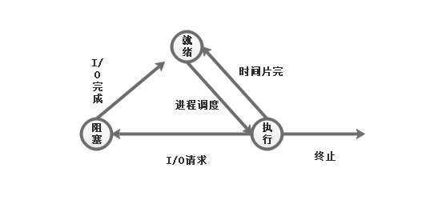

*本笔记的绝大多数内容取自《计算机操作系统》第四版 汤小丹*

# 操作系统引论

## 操作系统的基本特性

* 并发
* 共享
* 虚拟
* 异步

## 操作系统的主要功能

**处理机管理功能**

* 进程控制
* 进程同步
* 进程通信
* 调度

**存储器管理功能**

* 内存分配
* 内存保护
* 地址映射
* 内存扩充

**设备管理功能**

* 缓存管理
* 设备分配
* 设备处理

**文件管理功能**

* 文件存储空间的管理
* 目录管理
* 文件的读写管理和保护

## OS 结构演变

**传统操作系统结构**

* 无结构操作系统
* 模块化结构 OS
* 分层式结构 OS

**客户/服务器(C/S)模式**

**微内核 OS**

# 进程的描述和控制

## 进程的定义

为了使参与并发执行的每个程序都能独立运行，在操作系统中必须为之配置一个专门的数据结构，称为进程控制块 PCB，系统利用 PCB 来描述进程的基本情况和活动过程，进而控制和管理进程。这样，由程序段、相关的数据段和 PCB 便构成了进程实体（又称进程映像）。

进程就是进程实体的运行过程，是系统进行资源分配和调度的一个独立单位。所谓创建进程，实质上就是创建进程实体中的 PCB。撤销进程，就是撤销进程的 PCB。

## 进程的特征

* 动态性
* 并发性
* 独立性
* 异步性

## 进程的基本状态及转换

**3 个基本状态**

* 就绪（Ready）
* 执行（Running）
* 阻塞（Block）

为了满足进程控制块对数据及操作的完整性要求和管理的灵活性，添加了另外两种状态

* 创建状态
* 终止状态

### PCB 的作用

* 作为独立运行基本单位的标志
* 能实现间断性运行方式
* 提供进程管理所需要的信息
* 提供进程调度所需要的信息
* 实现与其他进程的同步与通信

### PCB 的内容

PCB 是一个数据结构

* 进程标识符
* 处理机状态
* 进程调度信息
* 进程控制信息

### 进程控制块的组织方式

* 线性方式：将系统中所有 PCB 都组织在一张线性表中
* 链接方式：将具有相同状态信息进程的 PCB 链接成一个队列，形成就绪队列，若干阻塞队列和空白队列
* 索引方式：系统根据所有进程状态的不同，建立几张索引表

### 进程的创建

**进程的层次结构**

UNIX 中进程与其子孙进程共同组成一个进程家族。子进程可以继承父进程所拥有的资源，当子进程被撤销时，应将从父进程那里获得的资源归还给父进程。在撤销父进程时，也必须同时撤销其所有的子进程。

Windows 中不存在进程层次结构的概念，所有的进程具有相同的地位。一个进程创建另一个进程时可以获得一个句柄，用来控制被创建的进程。句柄可以传递。

**引起进程创建的事件**

* 用户登录
* 作业调度
* 提供服务
* 应用请求

**进程创建的步骤**

1. 申请空白 PCB
2. 为新进程分配运行所需的资源
3. 初始化 PCB
4. 如果进程就绪队列可以接收新进程，则将新进程插入就绪队列

### 进程的终止

**引起进程终止的事件**

* 正常结束
* 异常结束
* 外界干预

**进程的终止过程**

1. 根据被终止进程的标识符，从 PCB 集合中检索出该进程的 PCB, 从中读出该进程的状态。
2. 若被终止的进程正处于执行状态，应立即终止该进程的执行，并置调度标志为真，用于指示该进程被终止后应重新进行调度
3. 若该进程还有子孙进程，还应将其子孙进程也都终止，以防止它们成为不可控的进程
4. 将被终止进程所拥有的全部资源或者归还给其父进程，或者归还给系统
5. 将被终止进程（PCB）从所在队列中移出，等待其他进程来搜集信息

### 进程的阻塞与唤醒

**如下几类事件会导致进程阻塞或唤醒**

1. 向系统请求共享资源失败
2. 等待某种操作的完成
3. 新数据尚未到达
4. 等待新任务的到达

### 进程同步

**进程同步的基本概念**

​		进程同步机制的主要任务，是对多个相关进程在执行次序上进行协调，使并发执行的诸进程间按照一定的规则共享系统资源，从而使程序的执行具有可再现性

**对多个进程存在的两种形式的制约关系**

* 间接相互制约关系（对临界资源的访问）
* 直接相互制约关系（进程任务间具有先后关系）

### 信号量机制

* 整型信号量
* 记录型信号量
* AND 型信号量
* 信号量集

### 信号量的应用

* 利用信号量实现进程互斥
* 利用信号量实现前趋关系

### 经典进程的同步问题

**生产者-消费者问题**

**哲学家进餐问题**

**读者-写者问题**

### 进程通信

**进程通信的类型**

* 共享存储器系统
  1. 基于共享数据结构的通信方式
  2. 基于共享存储区的通信方式

* 管道系统

  1. 管道是指用于连接一个读进程和一个写进程以实现它们之间通信的一个共享文件

* 消息传递系统
  1. 直接通信方式，是指发送进程利用 OS 所提供的发送原语，直接把消息发送给目标进程
  2. 间接通信方式，是指发送和接收进程，都通过共享中间实体（成为邮箱）的方式进行消息的发送和接收，完成进程间的通信

* 客户机-服务器系统

  1. 套接字（一个套接字就是一个通信标识类型的数据结构，包含了通信目的地址、通信使用的端口号、通信网络的传输层协议，进程所在的网络地址、以及针对客户或服务器程序提供的不同系统调用等）
     - 基于文件型（通信进程运行在同一台机器上，和管道类似）
     - 基于网络型

  2. 远程过程调用和远程方法调用

  ### 线程的概念

  **线程**（英语：thread）是操作系统能够进行运算调度的最小单位。它被包含在进程之中，是进程中的实际运作单位。一条线程指的是 [进程] 中一个单一顺序的控制流，一个进程中可以并发多个线程，每条线程并行执行不同的任务。在 Unix System V 及 SunOS 中也被称为轻量进程（lightweight processes），但轻量进程更多指内核线程（kernel thread），而把用户线程（user thread）称为线程。

  **进程与线程的比较**

| 类别 | 切换代价 | 并发性 | 拥有资源                                   | 独立性 | 系统开销 |
|-----|--------|-------|-------------------------------------------|-------|--------|
| 进程 | 高     |       | 拥有资源，并作为系统中拥有资源的一个基本单位      | 高    | 大     |
| 线程 | 低     |       | 仅拥有少量必须的资源，和其他线程共享进程拥有的资源 | 低    | 小     |

  

### 线程的状态和线程控制块 TCB

**线程运行的三个状态**

* 执行状态
* 就绪状态
* 阻塞状态

**TCB**

TCB 的内容：

* 线程标识符
* 一组寄存器
* 线程运行状态
* 线程专有存储区
* 信号屏蔽
* 堆栈指针

### 线程的实现

* 内核支持线程 KST(Kernel Supported Threads)
* 用户级线程 ULT(User Level Threads)

### 线程的创建和终止

**线程的创建：** 应用程序在启动时，通常仅有一个线程在执行，这个线程叫做初始化线程，它的主要功能是用于创建新线程。在创建新线程时，需要利用一个线程创建函数（或系统调用），并提供相应的参数，如指向线程主程序的入口指针，堆栈的大小，以及用于调度的优先级等。在线程的创建函数执行完后，将返回一个线程标识符供以后使用。

**线程的终止：** 当一个线程完成了自己的任务后，或是线程在运行后出现异常情况而须被强行终止时，由终止线程通过调用相应的函数（或系统调用）对它执行终止操作。

## 处理机调度与死锁

### 处理机调度的层次

* 高级调度（High Level Scheduling）又被称为长程调度或作业调度

| 调度类型 | 高级调度（长程调度或作业调度）                               | 中级调度（内存调度）                                         | 低级调度（进程调度或短程调度）                     |
| -------- | ------------------------------------------------------------ | ------------------------------------------------------------ | -------------------------------------------------- |
| 调度对象 | 作业                                                         | 进程                                                         | 进程或内核级线程                                   |
| 主要功能 | 根据某种算法，将外存上处于后备队列的作业调入内存，为它们创建进程，分配资源，并放入就绪队列 | 提高内存的利用率和系统吞吐量。将暂时不能运行的进程，调至外存等待，当这些进程又具备运行条件时，将其调入内存 | 根据某种算法，决定就绪队列中的哪个进程应获得处理机 |
| 调度频率 | 几分钟                                                       | 高级调度和低级调度之间                                       | 10-100ms                                           |

### 批处理系统中的作业

**作业和作业步**

* 作业（Job）比程序更加广泛的概念，不仅包含了程序和数据，还配有一份作业说明书，系统根据说明书来对程序的运行进行控制。在批处理系统中，是以作业为基本单位从外存调入内存的。
* 作业步（Job Step）通常，在作业运行期间，每个作业都必须经过若干个相对对立又相互关联的顺序加工步骤才能得到结果。我们把其中的每一个加工步骤称为一个作业步。

**作业控制块（Job Control Block JCB）**

它是作业在系统中存在的标志，其中保存了系统对作业进行管理和调度所需的全部信息。

**作业运行的三个阶段和三种状态**

1. 收容阶段 -> 后备状态
2. 运行阶段 -> 运行状态
3. 完成阶段 -> 完成状态

### 先来先服务(FCFS)和短作业优先(SJF)调度算法

**FCFS(First Come First Served)**

每次调度都是从就绪队列中选择一个最先进入该队列的进程，为之分配处理机，使之投入运行。该进程一直运行直到完成或者发生某件事情而阻塞后，才将处理机分配给其他进程。

**SJF(Short Job First)**

以作业的长短（运行时间）来计算优先级，作业越短，优先级越高

### 优先级调度算法和高响应比优先调度算法

**优先级调度算法(priority-scheduling algorithm PSA)**

由外部赋予作业相应的优先级，调度算法根据该优先级进行调度

**高响应比优先调度算法(Highest Response Ratio Next HRRN )**
$$
优先权 =\frac{等待时间 + 要求服务时间}{要求服务时间}
$$

### 进程调度

**进程调度的任务**

1. 保存处理机的现场信息
2. 按某种算法选取进程
3. 将处理机分配给进程

**进程调度方式**

1. 非抢占方式 在进程完成或阻塞前，其他进程不抢占处理机
2. 抢占方式 允许调度程序根据某种原则，去暂停某个正在执行的进程，将已分配给该进程的处理机重新分配给另一个进程

### 轮转调度算法（round robin RR）

系统根据 FCFS 策略，将所有的就绪进程排成一个就绪队列，并可设置每隔一个时间间隔产生一次中断，激活调度程序，完成一次调度，将 CPU 分配给队首进程。当该进程的时间片耗尽或者运行完毕，系统再次将 CPU 分配给新的队首进程

### 优先级调度算法

根据优先级来选取获得处理机的进程

* 非抢占式优先级调度算法
* 抢占式优先级调度算法

**优先级的分类**

* 静态优先级
* 动态优先级

### 多队列调度算法

该算法将系统中的进程就绪队列从一个拆分为若干个，将不同类型或性质的进程固定分配在不同的就绪队列，不同的就绪队列采用不同的调度算法，一个就绪队列中的进程可以设置不同的优先级，不同的就绪队列本身也可以设置不同的优先级。

### 多级反馈队列(multileved feedback queue) 调度算法

1. 设置多个就绪队列，为每个就绪队列赋予不同的优先级。第一个队列的优先级最高，第二个次之，依次类推。
2. 优先级最高的队列中，时间片最小，第二个队列的时间片更大，依次类推。
3. 每个队列都采用 FCFS 算法，当新进程进入内存后，放入第一个队列的末尾。当轮到该进程执行时，如果在时间片内能完成，则撤离系统，否则，进入第二个队列的末尾，如果在第二个队列的时间片内也未完成，则进入第三个队列的末尾，依次类推，对最后一个队列，则重新放回该队类末尾。
4. 按队列优先级调度，调度程序首先调度最高优先级队列中的进程，仅当该队列为空时才会去调度优先级次之的队列。如果处理机正在处理第 I 队列的某进程时有新进程进入任一优先级更高的队列，则立刻将正在处理的进程放入 i 队列的末尾，再将处理机分配给新到的高优先级进程

### 基于公平原则的调度算法

### 实时调度算法

**非抢占式调度算法**

* 非抢占式轮转调度算法
* 非抢占式优先调度算法 为实时任务安排较高优先级

**抢占式调度算法**

* 基于时钟中断的抢占式优先级调度算法
* 立即抢占的优先级调度算法

### 最早截至时间优先(Earliest Deadline First EDF)算法

根据任务的截至时间确定任务的优先级，任务的截至时间越早，其优先级越高

### 最低松弛度优先(Least Laxity First)算法

$$
松弛度 = 截至时间-进程运行所需时间-当前时间
$$

### 死锁概述

**可重用性资源和消耗性资源**

* 可重用性资源  如打印机
  1. 每一个可重用性资源中的单位只能分配给一个进程使用
  2. 进程在使用可重用性资源时，必须按照如下顺序：请求资源 -> 使用资源 -> 释放资源
  3. 系统中每一类可重用性资源的单元数目是固定的，进程在运行期间既不能创建也不能删除
* 可消耗性资源 在进程运行期间，由进程动态地创建和消耗的， 典型的如进程间通信的消息

**可抢占性资源和不可抢占性资源**

**死锁的成因**

* 竞争不可抢占性资源
* 竞争可消耗资源
* 进程推进顺序不当

## 产生死锁的必要条件

* 互斥
* 请求和保持
* 不可抢占
* 循环等待

## 解除死锁的办法

破坏除 互斥 外的其他三个条件

# 存储器管理

## 基于顺序搜索的动态分区分配算法

* 首次适应（first fit, FF）算法
* 循环首次适应（next fit NF）算法
* 最佳适应（best fit）算法
* 最坏适应（worst fit）算法

## 基于索引搜索的动态分区分配算法

* 快速适应（quick fit）算法
* 伙伴系统（buddy system）
* 哈希算法
# 虚拟存储器

## 页面置换算法

* 最佳置换算法 
    _选择淘汰的页面是以后不再使用的或者在最长时间内不再访问的页面_

* 先进先出（FIFO）页面置换算法

* 最近最久未使用（least recently used LRU）置换算法
    _用 最近的过去 模拟 最近的将来，赋予每个页面一个访问字段，用来记录一个页面自上次被访问以来经历的时间 t，当需要淘汰一个页面时，选择其中 t 最大的_

* 最少使用（least frequently used LFU）置换算法

* Clock 置换算法
    _LRU 近似算法，为每页设置一个访问位，再在内存中将所有页面链接成一个循环队列。当某个页面被访问时，其访问位置 1, 置换算法在选择一页淘汰时，只需检查页的访问位，如果是 0, 就将该页换出; 如果是 1，就将它置 0, 暂时不换出，给予该页面第二次驻留内存的机会_

* 页面缓冲算法（page buffering algorithm PBA）
# 输入输出系统

## 磁盘调度算法

* 先来先服务（FCFS）
* 扫描算法（SCAN）
* 循环扫描算法（CSCAN）
