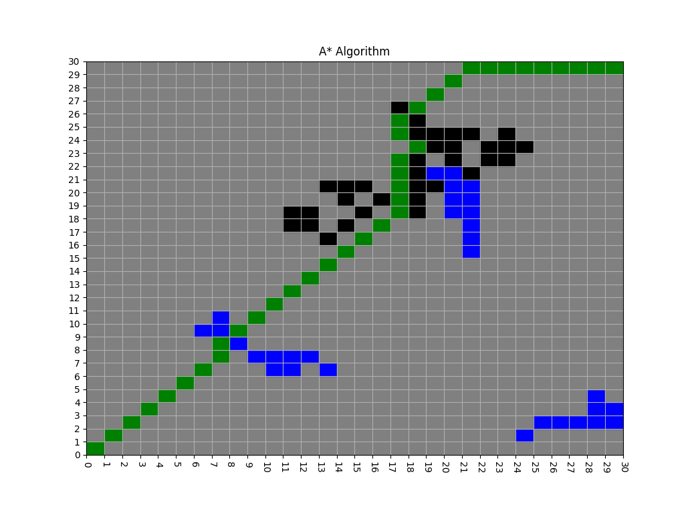

# A*算法

A Star 算法是一种比较简单的寻路算法，游戏中用的较多，本文简单实现二维和三维地图中
的 A Star 算法，本文只是做教学之用，所以仅考虑常规情况。

GitHub [链接](https://github.com/LiuYinCarl/basic_algorithm/tree/master)

## 效果图

**二维图形上的 A Star 算法**



**三维图形上的 A Star 算法**


## 二维地图上的 A* 算法实现

```python
from collections import namedtuple
import random
import numpy as np
import matplotlib.pyplot as plt
from matplotlib.ticker import MultipleLocator

###########################################################
# 生成随机地图
###########################################################

BlockDef = namedtuple("BlockDef", ["road", "water", "wall"])
BlockType = BlockDef(
    road  = 0,
    water = 1,
    wall  = 2,
)

class MapBlock(object):
    """地图块."""
    def __init__(self,x:int, y:int, block_type:BlockType) -> None:
        self.x:int = x
        self.y:int = y
        self.type:BlockType = block_type
        self.parent_block:MapBlock = None
        self.g_val = 0 # 到起点的距离
        self.h_val = 0 # 到终点的距离
        self.f_val = 0 # 综合距离 g_val + h_val

class RandomMap(object):
    """地图."""
    def __init__(self) -> None:
        self.map_length:int = 30
        self.map_height:int = 30
        self.map:list = []
        self.start_pos:MapBlock = None
        self.target_pos:MapBlock = None

        self.init_map()
        self.gen_random_wall()
        self.gen_random_water()

    def init_map(self):
        """初始化地图."""
        for i in range(self.map_length):
            self.map.append([])
            for j in range(self.map_height):
                self.map[i].append(MapBlock(i, j, BlockType.road))
        self.start_pos = self.map[0][0]
        self.target_pos = self.map[self.map_height-1][self.map_length-1]

    def _gen_consecutive_blocks(self, n:int):
        """获得一片连续的区块的坐标."""
        next_pos_offset = ((-1, 0), (-1, 1), (0, 1), (1, 1),
                           (1, 0), (1, -1), (0, -1), (-1, -1))
        blocks = []
        visited = set()
        x = random.randint(0, self.map_height-1)
        y = random.randint(0, self.map_length-1)
        blocks.append((x, y))
        visited.add(x * self.map_length * y)
        for _ in range(n-1):
            for _ in range(len(next_pos_offset)):
                # 只尝试 8 次
                offset = random.randint(0, 7)
                new_x = x + next_pos_offset[offset][0]
                new_y = y + next_pos_offset[offset][1]
                if (new_x < 0 or new_x >= self.map_height or
                    new_y < 0 or new_y >= self.map_length):
                    continue
                if new_x * self.map_length + new_y in visited:
                    continue
                blocks.append((new_x, new_y))
                visited.add(new_x * self.map_length + new_y)
                x, y = new_x, new_y
                break
        return blocks

    def gen_random_wall(self):
        """生成随机墙障碍."""
        for _ in range(3):
            block_poss = self._gen_consecutive_blocks(random.randint(10, 20))
            for pos in block_poss:
                block:MapBlock = self.map[pos[0]][pos[1]]
                block.type = BlockType.wall

    def gen_random_water(self):
        """生成随机水障碍."""
        for _ in range(3):
            block_poss = self._gen_consecutive_blocks(random.randint(10, 20))
            for pos in block_poss:
                block:MapBlock = self.map[pos[0]][pos[1]]
                block.type = BlockType.water

class AStar(object):
    """A* 寻路算法."""
    def __init__(self, map:RandomMap) -> None:
        self.open_list:list = []
        self.close_set:set = set()
        self.map:RandomMap = map
        self.open_list.append(self.map.start_pos)

    def find_path(self):
        """找到路径."""
        while len(self.open_list) > 0:
            print("len ", len(self.open_list))
            cur_block:MapBlock = self.open_list[0]
            # 找到了终点
            if (cur_block.x == self.map.target_pos.x and
                cur_block.y == self.map.target_pos.y):
                return True
            else:
                self.open_list.pop(0)
                self.close_set.add(cur_block)
                self.add_adjacent_block(cur_block)

    def get_path_block(self):
        """获取从起点到终点的路径."""
        path = []
        block = self.map.target_pos
        while block != None:
            path.insert(0, block)
            block = block.parent_block
        return path

    def add_adjacent_block(self, block:MapBlock):
        """添加相邻的区块到 open_list."""
        adjacent_block_offset = ((-1, 0), (-1, 1), (0, 1), (1, 1),
                                 (1, 0), (1, -1), (0, -1), (-1, -1))
        for offset in adjacent_block_offset:
            x = block.x + offset[0]
            y = block.y + offset[1]
            if (x < 0 or x >= self.map.map_height or
                y < 0 or y >= self.map.map_length):
                continue
            adjacent_block:MapBlock = self.map.map[x][y]
            if adjacent_block in self.close_set:
                continue
            if adjacent_block in self.open_list:
                continue
            if adjacent_block.type != BlockType.road:
                continue
            adjacent_block.parent_block = block
            adjacent_block.g_val = self.g(adjacent_block)
            adjacent_block.h_val = self.h(adjacent_block)
            adjacent_block.f_val = adjacent_block.g_val + adjacent_block.h_val
            
            self.open_list.append(adjacent_block)
            self.open_list.sort(key = lambda block: block.f_val)

    def h(self, block:MapBlock):
        """distabce of block to target block."""
        val = (10 * abs(self.map.target_pos.x - block.x)
              + 10 * abs(self.map.target_pos.y - block.y))
        return val

    def g(self, block:MapBlock):
        """distabce of block to start block."""
        val = block.parent_block.g_val
        # # 两个block邻接的话距离为 10，两个block对角线相接的话距离为 14
        if (block.parent_block.x == block.x or
            block.parent_block.y == block.y):
            val += 10
        else:
            val += 14
        return val

class Draw(object):
    """绘图."""
    def __init__(self, map:RandomMap, astar:AStar) -> None:
        self.map = map
        self.astar = astar
        self.ax = plt.subplot()

        self.init_ax()
        self.draw_map()
        self.draw_path()

        plt.show()

    def init_ax(self):
        plt.xlim(0, self.map.map_height)
        plt.ylim(0, self.map.map_length)

        self.ax.xaxis.set_major_locator(MultipleLocator(1))
        self.ax.yaxis.set_major_locator(MultipleLocator(1))
        self.ax.xaxis.grid(True, which="major")
        self.ax.yaxis.grid(True, which="major")

        plt.title("A* Algorithm")
        plt.xticks(rotation=270)

    def draw_map(self):
        for i in range(self.map.map_height):
            for j in range(self.map.map_length):
                block:MapBlock = self.map.map[i][j]
                y = np.linspace(j, j+1, 2)
                if block.type == BlockType.road:
                    self.ax.fill_betweenx(y, i, i+1, color="gray")
                elif block.type == BlockType.wall:
                    self.ax.fill_betweenx(y, i, i+1, color="black")
                elif block.type == BlockType.water:
                    self.ax.fill_betweenx(y, i, i+1, color="blue")
                else:
                    print("Unknown block type")

    def draw_path(self):
        path_block:list = astar.get_path_block()
        for block in path_block:
            if (block.type != BlockType.road):
                print("pos:({}, {}) wrong path type: {}".format(block.x, block.y, block.type))
                continue
            y = np.linspace(block.y, block.y+1, 2)
            self.ax.fill_betweenx(y, block.x, block.x+1, color="green")

if __name__ == "__main__":
    map = RandomMap()
    astar = AStar(map)
    astar.find_path()
    path_block = astar.get_path_block()
    print("start: ({}, {})".format(map.start_pos.x, map.start_pos.y))
    print("target: ({}, {})".format(map.target_pos.x, map.target_pos.y))
    path = ["({}, {})".format(block.x, block.y) for block in path_block]
    print(len(path_block))
    print("path: {}".format(" -> ".join(path)))

    Draw(map, astar)
    # draw_map(map)
```

## 三维地图上的 A* 算法实现

```python
from collections import namedtuple
import random
from turtle import color
import numpy as np
import matplotlib.pyplot as plt
from matplotlib.ticker import MultipleLocator

import math
import os
import pandas as pd
import matplotlib.cm as cm
from pyparsing import col       #导入库

###########################################################
# 生成随机地图
###########################################################

BlockDef = namedtuple("BlockDef", ["road", "water", "wall"])
BlockType = BlockDef(
    road  = 0,
    water = 1,
    wall  = 2,
)

class MapBlock(object):
    """地图块."""
    def __init__(self,x:int, y:int, z:int, block_type:BlockType) -> None:
        self.x:int = x
        self.y:int = y
        self.z:int = z
        self.type:BlockType = block_type
        self.parent_block:MapBlock = None
        self.g_val = 0 # 到起点的距离
        self.h_val = 0 # 到终点的距离
        self.f_val = 0 # 综合距离 g_val + h_val

class RandomMap(object):
    """地图."""
    def __init__(self) -> None:
        self.map_length:int = 20
        self.map_height:int = 20
        self.map:list = []
        self.start_pos:MapBlock = None
        self.target_pos:MapBlock = None

        self.init_map()
        self.gen_random_wall()
        self.gen_random_water()

    def init_map(self):
        """初始化地图."""
        for i in range(self.map_length):
            self.map.append([])
            for j in range(self.map_height):
                z = random.randint(0, 3) # 高度在 0 到 3 之间
                self.map[i].append(MapBlock(i, j, z, BlockType.road))
        self.start_pos = self.map[0][0]
        self.target_pos = self.map[self.map_height-1][self.map_length-1]

    def _gen_consecutive_blocks(self, n:int):
        """获得一片连续的区块的坐标."""
        next_pos_offset = ((-1, 0), (-1, 1), (0, 1), (1, 1),
                           (1, 0), (1, -1), (0, -1), (-1, -1))
        blocks = []
        visited = set()
        x = random.randint(0, self.map_height-1)
        y = random.randint(0, self.map_length-1)
        blocks.append((x, y))
        visited.add(x * self.map_length * y)
        for _ in range(n-1):
            for _ in range(len(next_pos_offset)):
                # 只尝试 8 次
                offset = random.randint(0, 7)
                new_x = x + next_pos_offset[offset][0]
                new_y = y + next_pos_offset[offset][1]
                if (new_x < 0 or new_x >= self.map_height or
                    new_y < 0 or new_y >= self.map_length):
                    continue
                if new_x * self.map_length + new_y in visited:
                    continue
                blocks.append((new_x, new_y))
                visited.add(new_x * self.map_length + new_y)
                x, y = new_x, new_y
                break
        return blocks

    def gen_random_wall(self):
        """生成随机墙障碍."""
        for _ in range(3):
            block_poss = self._gen_consecutive_blocks(random.randint(10, 20))
            for pos in block_poss:
                block:MapBlock = self.map[pos[0]][pos[1]]
                block.type = BlockType.wall

    def gen_random_water(self):
        """生成随机水障碍."""
        for _ in range(3):
            block_poss = self._gen_consecutive_blocks(random.randint(10, 20))
            for pos in block_poss:
                block:MapBlock = self.map[pos[0]][pos[1]]
                block.type = BlockType.water

class AStar(object):
    """A* 寻路算法."""
    def __init__(self, map:RandomMap) -> None:
        self.open_list:list = []
        self.close_set:set = set()
        self.map:RandomMap = map
        self.open_list.append(self.map.start_pos)

    def find_path(self):
        """找到路径."""
        while len(self.open_list) > 0:
            print("len ", len(self.open_list))
            cur_block:MapBlock = self.open_list[0]
            # 找到了终点
            if (cur_block.x == self.map.target_pos.x and
                cur_block.y == self.map.target_pos.y):
                return True
            else:
                self.open_list.pop(0)
                self.close_set.add(cur_block)
                self.add_adjacent_block(cur_block)

    def get_path_block(self):
        """获取从起点到终点的路径."""
        path = []
        block = self.map.target_pos
        while block != None:
            path.insert(0, block)
            block = block.parent_block
        return path

    def add_adjacent_block(self, block:MapBlock):
        """添加相邻的区块到 open_list."""
        adjacent_block_offset = ((-1, 0), (0, 1), (1, 0),  (0, -1), )
        for offset in adjacent_block_offset:
            x = block.x + offset[0]
            y = block.y + offset[1]
            if (x < 0 or x >= self.map.map_height or
                y < 0 or y >= self.map.map_length):
                continue
            adjacent_block:MapBlock = self.map.map[x][y]
            if adjacent_block in self.close_set:
                continue
            if adjacent_block in self.open_list:
                continue
            if adjacent_block.type != BlockType.road:
                continue
            # 如果两个区块之间的高度差太大，拒绝寻路
            if abs(adjacent_block.z - block.z) > 1:
                continue
            adjacent_block.parent_block = block
            adjacent_block.g_val = self.g(adjacent_block)
            adjacent_block.h_val = self.h(adjacent_block)
            adjacent_block.f_val = adjacent_block.g_val + adjacent_block.h_val
            
            self.open_list.append(adjacent_block)
            self.open_list.sort(key = lambda block: block.f_val)

    def h(self, block:MapBlock):
        """distabce of block to target block."""
        val = (10 * abs(self.map.target_pos.x - block.x)
              + 10 * abs(self.map.target_pos.y - block.y))
        return val

    def g(self, block:MapBlock):
        """distabce of block to start block."""
        val = block.parent_block.g_val
        # # 两个block邻接的话距离为 10，两个block对角线相接的话距离为 14
        if block.parent_block.x == block.x:
            diff_xy = abs(block.parent_block.y - block.y) # 两个block水平方向上的距离
        else:
            diff_xy = abs(block.parent_block.x - block.x)
        diff_z = abs(block.parent_block.z - block.z) # 两个block垂直方向上的距离
        distance = math.floor(math.sqrt(abs(diff_xy**2 + diff_z**2)))
        val += distance
        return val

class Draw(object):
    """绘图."""
    def __init__(self, map:RandomMap, astar:AStar) -> None:
        self.map = map
        self.astar = astar
        self.ax:plt.axes = plt.subplot(projection="3d") #设置3D绘图空间

        self.init_ax()
        self.draw_map()
        self.draw_path()

        plt.show()

    def init_ax(self):
        plt.xlim(0, self.map.map_height)
        plt.ylim(0, self.map.map_length)

        self.ax.xaxis.set_major_locator(MultipleLocator(1))
        self.ax.yaxis.set_major_locator(MultipleLocator(1))
        self.ax.xaxis.grid(True, which="major")
        self.ax.yaxis.grid(True, which="major")

        plt.xlabel('pos x')            #给x轴添加标签
        plt.ylabel('pos y')            #给y轴添加标签
        plt.title("3D A* Algorithm")
        plt.xticks(rotation=270)

    def draw_map(self):
        pos_x = []
        pos_y = []
        pos_z = []
        color = []
        for i in range(self.map.map_height):
            for j in range(self.map.map_length):
                pos_x.append(i)
                pos_y.append(j)
                pos_z.append(self.map.map[i][j].z)
                
                block:MapBlock = self.map.map[i][j]
                if block.type == BlockType.road:
                    color.append("grey")
                elif block.type == BlockType.wall:
                    color.append("black")
                elif block.type == BlockType.water:
                    color.append("blue")

        self.ax.bar3d(x=pos_x, y=pos_y, z=0, 
                      dx=1, dy=1, dz=pos_z, 
                      color=color)  #绘制3d直方图

    def draw_path(self):
        pos_x = []
        pos_y = []
        old_z = []
        pos_z = []
        color = []

        path_block:list = astar.get_path_block()
        if not path_block: # 没有路径则不绘制
            return
        for block in path_block:
            if (block.type != BlockType.road):
                print("pos:({}, {}) wrong path type: {}".format(block.x, block.y, block.type))
                continue
            pos_x.append(block.x)
            pos_y.append(block.y)
            old_z.append(block.z)
            pos_z.append(4 - block.z)
            color.append("green")

        self.ax.bar3d(x=pos_x, y=pos_y, z=old_z, 
                      dx=1, dy=1, dz=pos_z, 
                      color=color)  #绘制3d直方图

if __name__ == "__main__":
    map = RandomMap()
    astar = AStar(map)
    astar.find_path()
    path_block = astar.get_path_block()
    print("start: ({}, {})".format(map.start_pos.x, map.start_pos.y))
    print("target: ({}, {})".format(map.target_pos.x, map.target_pos.y))
    path = ["({}, {})".format(block.x, block.y) for block in path_block]
    print(len(path_block))
    print("path: {}".format(" -> ".join(path)))

    Draw(map, astar)
    # draw_map(map)
```

## 未完善的部分

三维地图上的 A* 算法实现并非是完善的实现，有一些情况是没有考虑到的，例如 A 点和 B 点之间的直线路径上有一座很高的山，但是山中有一个 A 点直达 B 点的直线山洞，目前的三维地图实现中不允许存在山洞，所有这种情况无法处理。