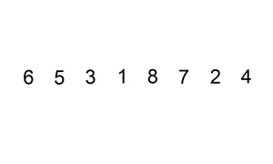
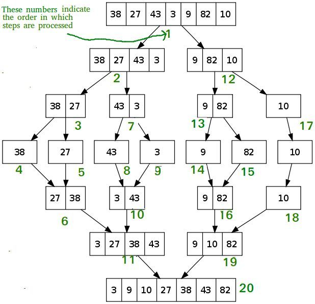
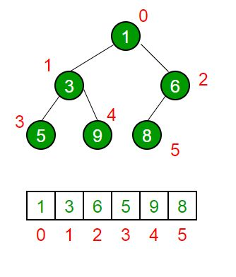
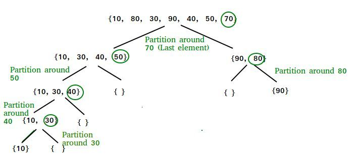

**转载**

> [视频 | 手撕九大经典排序算法，看我就够了！](https://zhuanlan.zhihu.com/p/52884590)


## 插入排序



每次选择一个元素，并且将这个元素和已排序数组中的所有元素进行比较，然后插入到合适的位置，图片演示如上，时间复杂度 O(n^2)。

```c++
void insertion_sort(int arr[], int length)
{

    int i,j;
    for (i = 1; i < length; i++) {
        int tmp = arr[i];
        for (j = i; j > 0 && arr[j - 1] > tmp; j--) {
            arr[j] = arr[j - 1];
        }
        arr[j] = tmp;
    }

}

```


## 希尔排序

这个是插入排序的修改版，根据步长由长到短分组，进行排序，直到步长为 1 为止，属于插入排序的一种。

```c++
int shellSort(int arr[], int n) 
{ 
    for (int gap = n/2; gap > 0; gap /= 2) 
    { 
        for (int i = gap; i < n; i += 1) 
        { 
            int temp = arr[i]; 
            int j;
            for (j = i; j >= gap && arr[j - gap] > temp; j -= gap) 
                arr[j] = arr[j - gap]; 
            arr[j] = temp; 
        } 
    } 
    return 0; 
} 
```


## 基数排序

基数排序是一种非比较型整数排序算法，其原理是将整数按位数切割成不同的数字，然后按每个位数分别比较。排序过程是将所有待比较数值统一为同样的数位长度，数位较短的数前面补零，然后从最低位开始，依次进行一次排序。这样从最低位排序一直到最高位排序完成以后, 数列就变成一个有序序列。

```c++
int getMax(int arr[], int n) 
{ 

    int mx = arr[0]; 
    for (int i = 1; i < n; i++) 
        if (arr[i] > mx) 
            mx = arr[i]; 
    return mx; 

} 

void countSort(int arr[], int n, int exp) 
{ 

    int output[n]; 
    int i, count[10] = {0}; 

  

    for (i = 0; i < n; i++) 
        count[ (arr[i]/exp)%10 ]++; 

  

    for (i = 1; i < 10; i++) 
        count[i] += count[i - 1]; 

  

    for (i = n - 1; i >= 0; i--) 
    { 
        output[count[ (arr[i]/exp)%10 ] - 1] = arr[i]; 
        count[ (arr[i]/exp)%10 ]--; 
    } 

  

    for (i = 0; i < n; i++) 
        arr[i] = output[i]; 

} 
  
void radixsort(int arr[], int n) 
{ 

    int m = getMax(arr, n); 
    for (int exp = 1; m/exp > 0; exp *= 10) 
        countSort(arr, n, exp); 

} 

```


## 冒泡排序

每次选择两个元素，按照需求进行交换（比如需要升序排列的话，把较大的元素放在靠后一些的位置），循环 n 次（n 为总元素个数），这样小的元素会不断 “冒泡” 到前面来，时间复杂度 O(n^2)，C++ 代码如下：

```c++
void bubbleSort(vector<int>& a)
{
      bool swapp = true;
      while(swapp){
        swapp = false;
        for (size_t i = 0; i < a.size()-1; i++) {
            if (a[i]>a[i+1] ){
                a[i] += a[i+1];
                a[i+1] = a[i] - a[i+1];
                a[i] -=a[i+1];
                swapp = true;
            }
        }
    }
}
```


## 归并排序

归并排序相比较之前的排序算法而言加入了分治法的思想，其算法思路如下：

1. 如果给的数组只有一个元素的话，直接返回（也就是递归到最底层的一个情况）

2. 把整个数组分为尽可能相等的两个部分（分）

3. 对于两个被分开的两个部分进行整个归并排序（治）

4. 把两个被分开且排好序的数组拼接在一起




```c++
void merge(int arr[], int l, int m, int r) 
{ 
    int i, j, k; 
    int n1 = m - l + 1; 
    int n2 =  r - m; 

    int L[n1], R[n2]; 

    for (i = 0; i < n1; i++) 
        L[i] = arr[l + i]; 
    for (j = 0; j < n2; j++) 
        R[j] = arr[m + 1+ j]; 

    i = 0; 
    j = 0; 
    k = l; 
    while (i < n1 && j < n2) 
    { 
        if (L[i] <= R[j]) 
        { 
            arr[k] = L[i]; 
            i++; 
        } 
        else
        { 
            arr[k] = R[j]; 
            j++; 
        } 
        k++; 
    } 
    while (i < n1) 
    { 
        arr[k] = L[i]; 
        i++; 
        k++; 
    } 

    while (j < n2) 
    { 
        arr[k] = R[j]; 
        j++; 
        k++; 
    } 
} 
  
void mergeSort(int arr[], int l, int r) 
{ 

    if (l < r) 
    { 
        int m = l+(r-l)/2; 
        mergeSort(arr, l, m); 
        mergeSort(arr, m+1, r); 
        merge(arr, l, m, r); 
    } 
} 
```


## 堆排序

堆排序是一种基于二叉堆（Binary Heap）结构的排序算法，所谓二叉堆，我们通过完全二叉树来对比，只不过相比较完全二叉树而言，二叉堆的所有父节点的值都大于（或者小于）它的孩子节点，像这样：



首先需要引入最大堆的定义：

* 最大堆中的最大元素值出现在根结点（堆顶）
* 堆中每个父节点的元素值都大于等于其孩子结点

建立堆函数：

```c++
void heapify(int arr[], int n, int i) 
{ 
    int largest = i; // 将最大元素设置为堆顶元素
    int l = 2*i + 1; // left = 2*i + 1 
    int r = 2*i + 2; // right = 2*i + 2 
  
    // 如果 left 比 root 大的话
    if (l < n && arr[l] > arr[largest]) 
        largest = l; 
  
    // I如果 right 比 root 大的话
    if (r < n && arr[r] > arr[largest]) 
        largest = r; 
  
    if (largest != i) 
    { 
        swap(arr[i], arr[largest]); 
  
        // 递归地定义子堆
        heapify(arr, n, largest); 
    } 
} 
```

堆排序的方法如下，把最大堆堆顶的最大数取出，将剩余的堆继续调整为最大堆，再次将堆顶的最大数取出，这个过程持续到剩余数只有一个时结束。

堆排序函数：

```c++
void heapSort(int arr[], int n) 
{ 
    // 建立堆
    for (int i = n / 2 - 1; i >= 0; i--) 
        heapify(arr, n, i); 
    // 一个个从堆顶取出元素
    for (int i=n-1; i>=0; i--) 
    { 
        swap(arr[0], arr[i]);  
        heapify(arr, i, 0); 
    } 
} 

```

## 桶排序

桶排序的原理是将数组分到有限数量的桶中，再对每个桶子再分别排序（有可能再使用别的排序算法或是以递归方式继续使用桶排序进行排序），最后将各个桶中的数据有序的合并起来。

排序过程：

1. 假设待排序的一组数统一的分布在一个范围中，并将这一范围划分成几个子范围，也就是桶
2. 将待排序的一组数，分档规入这些子桶，并将桶中的数据进行排序
3. 将各个桶中的数据有序的合并起来

```c++
void bucketSort(float arr[], int n) 
{ 
    // 1) Create n empty buckets 
    vector<float> b[n]; 
     
    // 2) Put array elements in different buckets 
    for (int i=0; i<n; i++) 
    { 
       int bi = n*arr[i]; // Index in bucket 
       b[bi].push_back(arr[i]); 
    } 
  
    // 3) Sort individual buckets 
    for (int i=0; i<n; i++) 
       sort(b[i].begin(), b[i].end()); 
  
    // 4) Concatenate all buckets into arr[] 
    int index = 0; 
    for (int i = 0; i < n; i++) 
        for (int j = 0; j < b[i].size(); j++) 
          arr[index++] = b[i][j]; 
}
```

## 快速排序

简称快排，时间复杂度并不固定，如果在最坏情况下（元素刚好是反向的）速度比较慢，达到 O(n^2)（和选择排序一个效率），但是如果在比较理想的情况下时间复杂度 O(nlogn)。

快排也是一个分治的算法，快排算法每次选择一个元素并且将整个数组以那个元素分为两部分，根据实现算法的不同，元素的选择一般有如下几种：

* 永远选择第一个元素
* 永远选择最后一个元素
* 随机选择元素
* 取中间值

整个快速排序的核心是分区（partition），分区的目的是传入一个数组和选定的一个元素，把所有小于那个元素的其他元素放在左边，大于的放在右边。




算法导论中给出的分区算法伪代码如下：

```c++
partition (arr[], low, high)
{
    // pivot (Element to be placed at right position)
    pivot = arr[high];  
    i = (low - 1)  // Index of smaller element

    for (j = low; j <= high- 1; j++)
    {
        // If current element is smaller than or
        // equal to pivot
        if (arr[j] <= pivot)
        {
            i++;    // increment index of smaller element
            swap arr[i] and arr[j]
        }
    }
    swap arr[i + 1] and arr[high])
    return (i + 1)
}
```

其思路是每次从最左元素中选择一个元素并且将小于等于那个元素的元素的下标标记为 i ，在整个遍历过程中，如果我们找到一个更加小的元素，我们就把这个元素和数组中第 i 个元素交换。 
