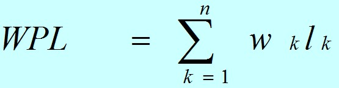
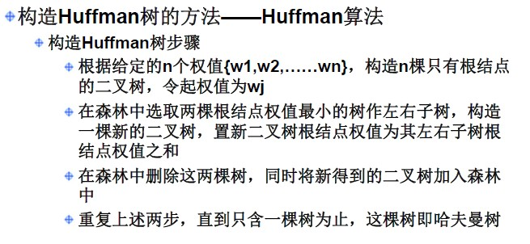
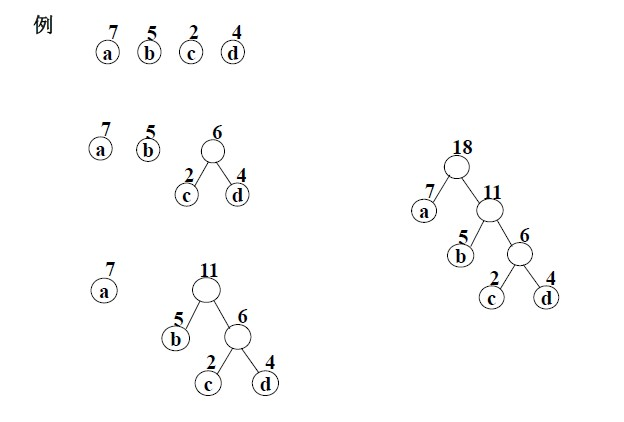

(部分)**转载**

> [霍夫曼树和霍夫曼编码原理](https://blog.csdn.net/sddxqlrjxr/article/details/51114809)

## 定义

**定义概念**

* 路径：树中一个节点到另一个节点之间的分支构成这两个节点之间的路

* 路径长度：路径上的分支数目叫做路径长度

* 树的路径长度：从树根到每一个节点的路径长度之和

* 节点的带权路径长度：在一棵树中，如果其节点上附带有一个权值，通常把该节点的路径长度与该节点上的权值之积称之为该节点的带权路径长度

* 树的带权路径长度：如果树中每个叶子都带有一个权值，则把树中所有叶子的带权路径长度之和称之为树的带权路径长度。设二叉树有 n 个带权的叶子节点，则该二叉树的带权路径长度为：

    

    公式中，wk 为第 k 个叶子结点的权值；lk 为该结点的路径长度。

 

​		一般来说，用 n（n > 0）个带权值的叶子来构造二叉树，限定二叉树中除了这 n 个叶子外只能出现度为 2 的结点。那么符合这样条件的二叉树往往可构造出许多颗，其中带权路径长度最小的二叉树就称为哈夫曼树或最优二叉树。

## 霍夫曼树的构造

​		根据哈弗曼树的定义，一棵二叉树要使其 WPL 值最小，必须使权值越大的叶子结点越靠近根结点，而权值越小的叶子结点越远离根结点。霍夫曼依据这一特点提出了一种构造最优二叉树的方法，其基本思想如下：

​		下面演示了用 Huffman 算法构造一棵 Huffman 树的过程：

