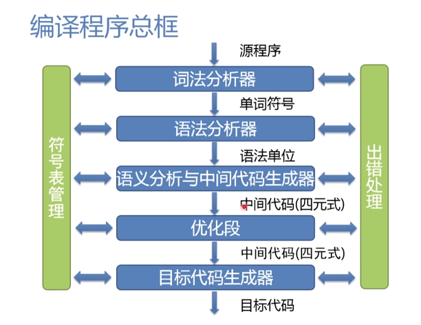
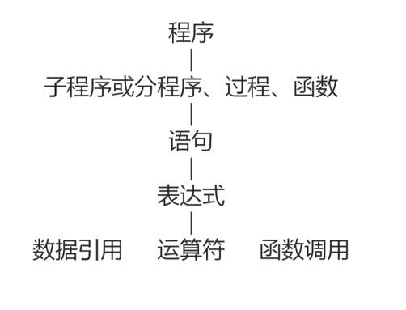

## 编译过程与自然语言翻译的对比

将英文翻译为中文

```

| 将英文翻译为中文           | 编译程序将一个程序从源语言翻译为目标语言 |
| ----------------------- | --------------------------------- |
| 识别出句子中的一个个单词    | 词法分析                           |
| 分析句子的语法结构         | 语法分析                           |
| 根据句子的含义进行初步翻译  | 中间代码产生                        |
| 对译文进行修饰            | 优化                               |
| 写出最后的译文            | 目标代码产生                        |
```


## 词法分析

**任务**： 输入源程序，对构成源程序的字符串进行扫描和分解，识别出单词符号

**依循的原则**：构词规则

**描述工具**：有限自动机

例子：

``` pascal
for i := 1 	to	100	do:
// 基本字 for to do
// 标识符 i
// 赋值号 :=
// 整常数 1 100
```


## 语法分析

**任务：** 在词法分析的基础上，根据语法规则把单词符号串分解为各类语法单元

**依循的原则：** 语法规则

**描述工具：** 上下文无关文法


## 中间代码产生

**任务：** 对各类语法单元按语言的语义进行初步翻译

**依循的原则：** 语义规则

**描述工具：** 属性文法

**中间代码：** 三元式、四元式、树


## 优化

**任务：** 对前阶段产生的中间代码进行加工变换、以期在最后阶段产生更高效的目标代码

**依循的原则：** 程序的等价变换原则


## 目标代码生成

**任务：** 把中间代码变换为特定机器上的目标代码

依赖于硬件系统结构和机器指令的含义

**目标代码的三种形式：** 

* 汇编指令代码：需要进行汇编
* 据对指令代码：可直接执行
* 可重定位指令代码：需要链接


## 编译程序总框





## 编译过程中的几个概念


### 遍

对源程序或源程序的中间表示从头到尾扫描一次

**阶段与遍是不同的概念**

* 一遍可以有若干阶段组成
* 一个阶段也可以分成若干遍来完成


## 编译前端与后端


**编译前端:** 与源程序有关，如词法分析，语法分析，语义分析和中间代码生成，与机器无关的优化

**编译后端：** 与目标机有关，与目标机有关的优化，目标代码生成

**编译分前后端的优势：**

* 逻辑结构清晰
* 优化更充分，有利于移植


## 编译程序自动生成程序

**LEX:** 词法分析程序产生器

**YACC:** 语法分析程序产生器


## 语法

* 程序本质上是一定字符集上的字符串
* **语法** 是一组规则，用它可以形成和产生一个合式（well-formed）的程序


### 词法规则

单词符号的形成规则

* 单词符号是语言中具有独立意义的最基本结构
* 一般包括：常数、标识符、基本字、算符、界符等
* 描述工具：有限自动机


### 语法规则

语法单位的形成规则

* 语法单位通常包括：表达式、语句、分程序、过程、函数、程序等
* 描述工具：上下文无关文法

**语法规则和词法规则定义了程序的形式结构**

**定义语法单位的意义属于语义问题**


## 语义


### 语义

* 一组规则，用它可以定义一个程序的意义


### 描述方法

* 自然语言描述
  + 二义性，隐藏错误和不完整性
* 形式描述
  + 操作语义
  + 指称语义
  + 代数语义


## 程序语言的基本功能和层次结构

* 程序，本质上来说是描述一定数据的处理过程
* 程序语言的基本功能
  + 描述数据和对数据的运算


### 程序的层次结构




## 标识符与名字


### 标识符

* 以字母开头的，由字母数字组成的字符串


### 名字

* 标志程序中的对象


### 标识符与名字的本质区别

* 标识符是语法概念
* 名字由确切的意义和属性

**名字的意义和属性**

* **值：** 单元中的内容
* **属性：** 类型和作用域

**名字的说明方式**

* 由说明语句来明确规定

  

  + `int score`
* 隐含说明
* FORTRAN 中以 I, J, K, ..., N 为首的名字代表整型，否则为实型
* 动态确定

  + Python 中的变量


### 抽象数据类型

* 一个抽象数据类型包括
  + 数据对象集合
  + 作用于这些数据对象的抽象运算的集合
  + 这种类型对象的封装，即除了使用
* 程序设计语言对抽象数据类型的支持
  + Ada 语言提供程序包提供
  + Java，C++这种面向对象的语言通过类提供

---


## 语句与控制结构


### 表达式

* 表达式由运算量（也称为操作数，即数据引用或函数调用）和算符（运算符、操作符）组成
* 形式： 中缀、前缀、后缀
* 表达式形成规则


### 算符的优先次序

* 一般的规定
  + 各种语言中定义不同
* 代数性质
  + 代数性质能引用到什么程度视具体的语言而定
  + 在数学上成立的代数性质在计算机上未必完全成立


### 语句

* 赋值语句

  

``` pascal
  A := B
```

  + 名字的 **左值：** 该名字代表的存储单元的 **地址**
  + 名字的 **右值：** 该名字代表的存储单元的 **内容**

* 控制语句

  + 无条件跳转语句 `goto`
  + 条件语句
  + 循环语句
  + 过程调用语句
  + 返回语句

---


## 文法

**描述语言的语法结构的形式规则**


## 语法描述的几个基本概念

* **字母表：** 一个有穷字符集，记为  $ \Sigma$
* 字母表中的每个元素称为 **字符**
* $\Sigma$ 上的字（也叫字符串）是指由  $\Sigma$ 中的字符所构成的一个有穷序列
* 不包含任何字符的序列称为 **空字**， 记为 $\varepsilon$
*   用 $\Sigma^*$  表示 $\Sigma$ 上的 * *字的全体**， 包含空字 $\varepsilon$ 
* 例如，设$\Sigma =\{a, b\}$ , 则 $\Sigma^* = \{ \varepsilon, a, b, aa, ab, bb, aaa, ... \}$


## 语法描述的几个基本概念

* $\Sigma ^*$ 的子集 U 和 V 的连接（积）定义为

$$
UV = \{ \alpha\beta \ |\ \alpha \in U \& \beta \in V \}
$$

* $V$ 的 n 次积记作

$$
V^n = VVVV(n 个)
$$

* $V^0 = \{ \varepsilon \}$

$V^*$ 是 $V$ 的闭包
$$
V^* = V^0 \cup V^1 \cup V^2 \cup V^3 ...
$$

$V^+$ 是 $V$ 的正规闭包
$$
V^+ = VV^*
$$
**一个字集的闭包和正规闭包有时候相等，有时候不等**, 区别在于原来没有空字， $V$ 的闭包 $V^*$ 一定会有空字， 而 $V$ 的正规闭包 $V^+ $ 不会有空字。


## 上下文无关文法

上下文无关文法 G 是一个四元组 $G = (V_T, V_N, S, P)$, 其中

* $V_T$ : 终结符（Terminal）集合（非空）

* $V_N$ : 非终结符(Nonterminal)集合(非空)，且 $V_T \cap V_N = \phi$

* $S$: 文法的开始符号，$S \in V_N$

* $P$: 产生式集合（有限），每个产生式形式为

  $$
  P \rightarrow \alpha, P \in V_N, \alpha \in (V_T \cup V_N)^*
  $$
  
* 开始符号$S$ 必须在某个产生式的左部出现一次
