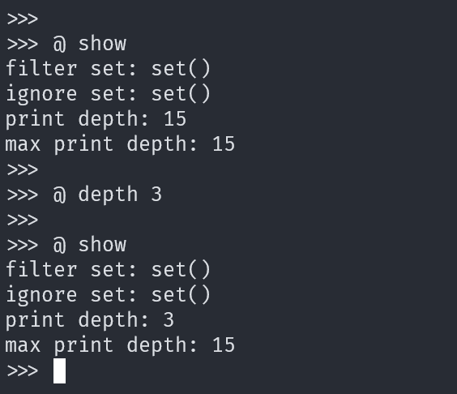
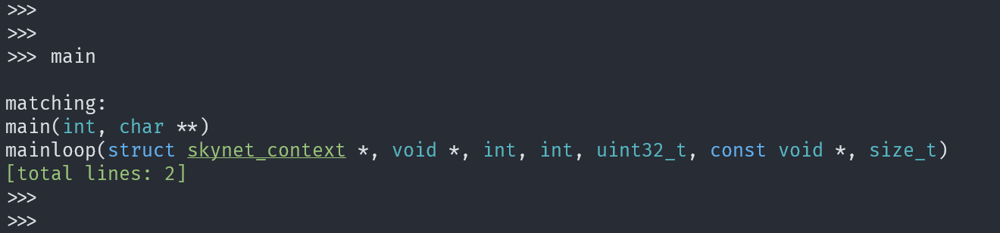
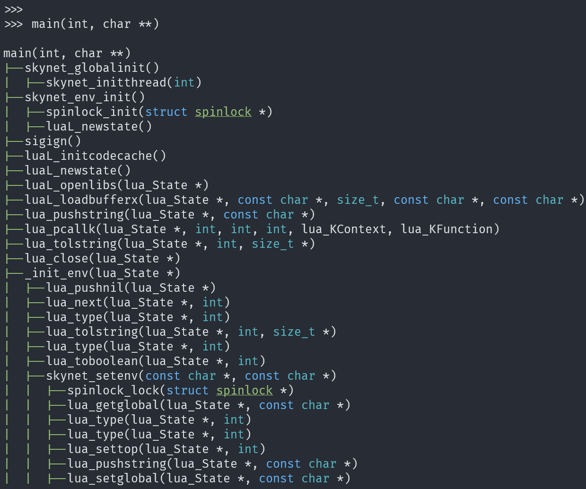
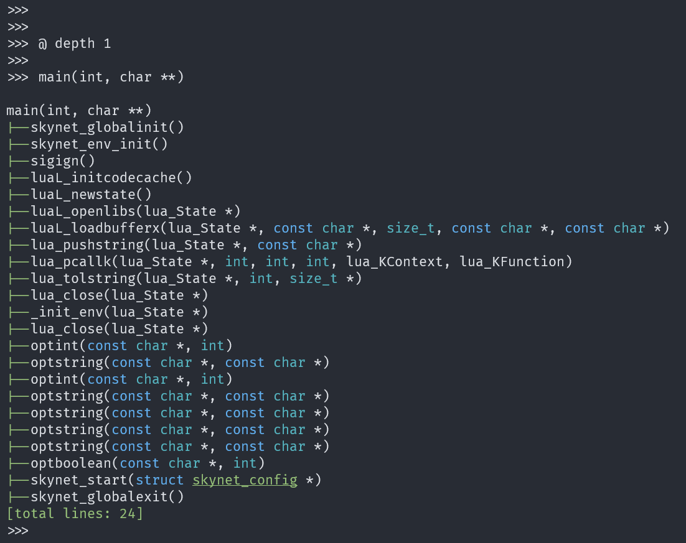
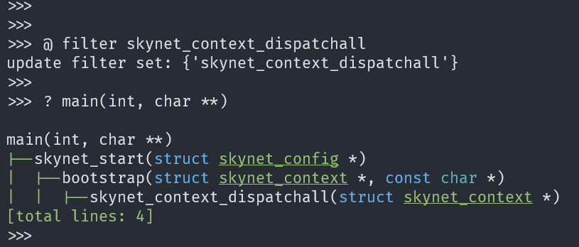
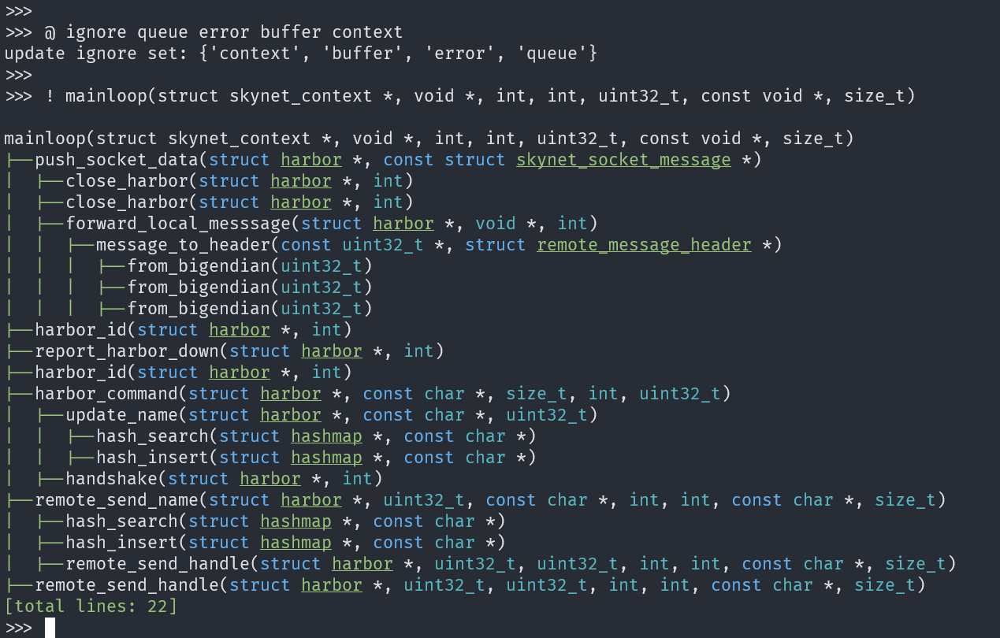
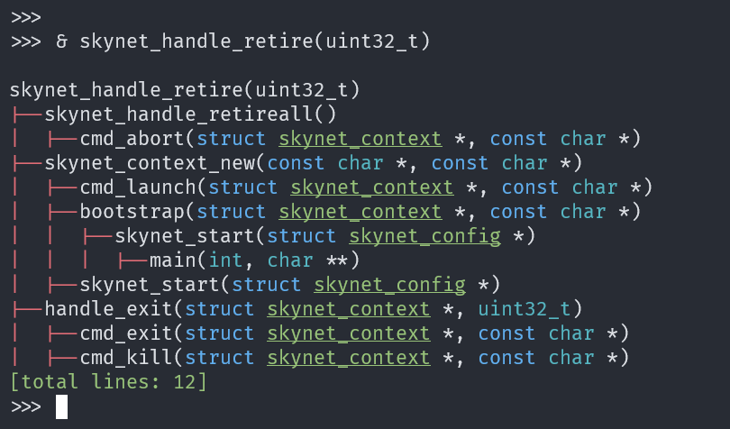
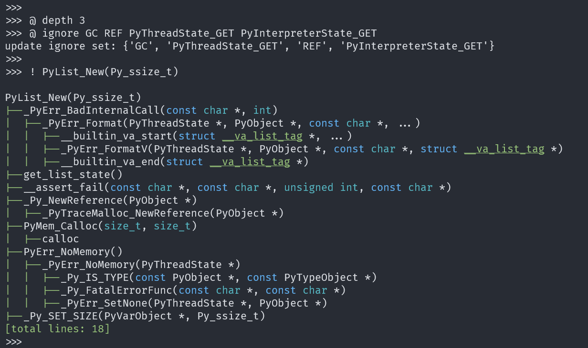

# clang-callgraph 调用链工具使用

clang-callgraph 是一个辅助分析代码的 python 包，可以分析 C/C++ 函数的调用链、反向调用链。这个库是我从 [Vermeille/clang-callgraph](https://github.com/Vermeille/clang-callgraph) fork 而来，原作者在最近的 [issue#13](https://github.com/Vermeille/clang-callgraph/issues/13#issuecomment-1590842648) 里说不再维护，所以才 fork 了一份，自己增加和维护一些功能。目前主要的改动包括：

- 集成 `readline`，支持了 Tab 自动补全。
- 集成 `pygments`，支持函数颜色展示，其实可以支持配置代码主题，但是先暂缓吧。
- 支持查询调用链、可通过配置关键字来只搜寻部分调用链或者忽略部分调用链，使得调用链更清晰。
- 支持查询反向调用链、比如函数调用链如下 `A -> B -> C`，那么输入 `C`，可以反向展示 `C -> B -> A` 的反向调用链。
- 支持交互式查询，类似 `Redis`，`CPython` 等的交互式查询。
- 支持只展示指定多少调用层级的调用链。
- 支持源码修改后更新调用链（这个目前拉了一个分支做了一个 demo，不过优先级不高，而且要处理多线程问题，慢慢做吧）。

### 安装方法

这个包主要需要安装 `libclang-14`，以 `Ubuntu` 系统为例来进行安装，其他 Linux 操作系统方法差不多。

```
# 安装依赖库
$ sudo apt install libclang-14-dev
# 安装 Python 依赖库
$ pip3 install clang==14
# 下载并安装 clang-callgraph 包
# 需要注意，如果提示 clang-callgraph 没有被安装到系统路径，那么改一下 PATH
# 增加 clang-callpath 的安装目录到 PATH 就好
$ git clone https://github.com/LiuYinCarl/clang-callgraph.git
$ cd clang-callgraph
$ pip3 install .

# 下载 skynet 源码库并且编译，这里我们使用 bear 这个工具生成
# compile_commands.json，clang-callgraph 需要这个文件来梳理
# 项目的调用图
$ git clone https://github.com/cloudwu/skynet.git
$ bear -- make linux

# 进入 skynet 的源码库，使用 clang-callgraph
$ clang-callgraph ./compile_commands.json
```

### 原理

这个包主要是使用 `libclang` 来解析 C/C++ 代码，然后利用解析出来的代码抽象语法树信息来构建调用图和引用图。这里需要特别注意，因为这里使用的是 libclang-14, 所以一些使用了比较新的 C/C++ 语法的源代码可能不能很好的进行分析，需要考虑升级一下这个库，不过我目前主要用 `clang-callgraph` 来分析一些 C 语言的项目，如 `CPython`, `Lua`, `skynet` 等，所以暂时没有升级动力。

### 指令展示

为了避免和函数名有冲突，所以 `clang-callgraph` 的命令都是以特殊字符开头，目前支持 4 种指令。

- `@` 开头的指令是命令指令，主要用来设置一些参数，例如 `@ filter error info` 就是新增两个过滤关键字 `error` 和 `info`。
- `?`开头的指令是调用链（过滤版本）查询，如果通过  `@ filter error info` 设置了 `error` 和 `info` 关键字，那么 `? main()` 这条指令就只会查询从 `main()` 函数开始，到包含 `error` 或者 `info` 关键字的函数为止的调用链。
- `！`开头的指令是调用链(忽略版本)查询，如果通过 `@ ignore error info` 设置了 `error` 和 `info` 关键字，那么 `! main()` 这条指令就是查询从 `main()` 函数开始，且调用链中不包含 `error` 和 `info` 关键字的所有调用链。
- `&` 开头的指令是反向调用链查询，`? exit(int)` 指令就是查询 `exit(int)` 这个函数的反向调用链。 目前暂时不支持关键字过滤和忽略（主要是感觉没什么用）。

## 实际效果展示

以上面安装的 skynet 为例，来看一下 `clang-callgraph` 的实际使用

首先设置下只展示三层调用链。



接着查看一下所有以 `main` 开头的函数，这里查询完成之后，查询结果会缓存到系统中，下次重新查询函数列表前就可以使用 Tab 对这些查询结果进行补全。



查看 `main(int, char **)` 的调用图，这里可以用 Tab 进行补全。



结果比较多，所以我们重新设置一下，只看 1 层调用链。



接着介绍一下过滤功能，这个功能可以让我们只专注于 函数 A 到 函数 B 的调用链。假设我们只想关注从 `main` 函数到 `skynet_context_dispatchall` 函数的调用，那么我们按照如下指令进行查询。



可以看到，调用链非常的清晰。

和这个类似的是忽略功能，这个功能的使用场景是，希望研究函数 A 的所有调用链，但是希望忽略掉里面日志，告警等一些不重要的函数。使用方法如下。



最后介绍一下反向调用链查询工具，这个功能的使用场景是，你正在研究函数 A，希望知道函数 A 在哪些调用路径中被最终调用到了。比如我们希望知道在 skynet 中 `skynet_handle_retire(uint32_t)` 会在哪些场景中被最终调用到。



考虑到 `skynet` 很多人不是很熟悉，那么我们使用 `clang-callgraph` 研究一下 CPython 中列表的创建过程吧。因为 `clang-callgraph` 是用 Python 写的，会比较慢，所以对于一些大型项目，建议先设置一下最大调用链深度，并且设置忽略一些非常频繁的关键字。下面是示例。



