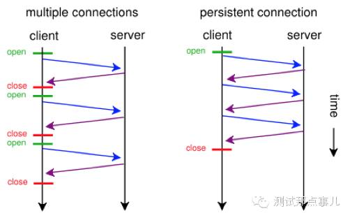
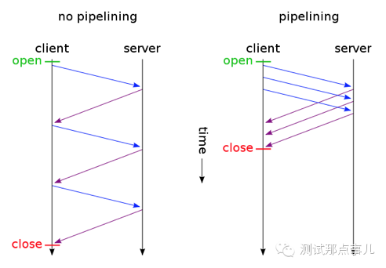

转载：https://www.cnblogs.com/andashu/p/6441271.html

# 各版本 HTTP 协议对比

​		HTTP 协议到现在为止总共经历了 3 个版本的演化，第一个 HTTP 协议诞生于 1989 年 3 月。

## HTTP 0.9

HTTP 0.9 是第一个版本的 HTTP 协议，已过时。它的组成极其简单，只允许客户端发送 GET 这一种请求，且不支持请求头。由于没有协议头，造成了 HTTP 0.9 协议只支持一种内容，即纯文本。不过网页仍然支持用 HTML 语言格式化，同时无法插入图片。

HTTP 0.9 具有典型的无状态性，每个事务独立进行处理，事务结束时就释放这个连接。由此可见，HTTP 协议的无状态特点在其第一个版本 0.9 中已经成型。一次 HTTP 0.9 的传输首先要建立一个由客户端到 Web 服务器的 TCP 连接，由客户端发起一个请求，然后由 Web 服务器返回页面内容，然后连接会关闭。如果请求的页面不存在，也不会返回任何错误码。

HTTP 0.9 协议文档：
http://www.w3.org/Protocols/HTTP/AsImplemented.html

## HTTP 1.0

HTTP 协议的第二个版本，第一个在通讯中指定版本号的 HTTP 协议版本，至今仍被广泛采用。相对于 HTTP 0.9 增加了如下主要特性：

* 请求与响应支持头域
* 响应对象以一个响应状态行开始
* 响应对象不只限于超文本
* 开始支持客户端通过 POST 方法向 Web 服务器提交数据，支持 GET、HEAD、POST 方法
* 支持长连接（但默认还是使用短连接），缓存机制，以及身份认证

## HTTP 1.1

HTTP 协议的第三个版本是 HTTP 1.1，是目前使用最广泛的协议版本。HTTP 1.1 是目前主流的 HTTP 协议版本，因此这里就多花一些笔墨介绍一下 HTTP 1.1 的特性。

HTTP 1.1 引入了许多关键性能优化：keepalive 连接，chunked 编码传输，字节范围请求，请求流水线等。

* Persistent Connection（keepalive 连接）

    允许 HTTP 设备在事务处理结束之后将 TCP 连接保持在打开的状态，以便未来的 HTTP 请求重用现在的连接，直到客户端或服务器端决定将其关闭为止。
    在 HTTP 1.0 中使用长连接需要添加请求头 Connection: Keep-Alive，而在 HTTP 1.1 所有的连接默认都是长连接，除非特殊声明不支持（ HTTP 请求报文首部加上 Connection: close ）

* chunked 编码传输

    该编码将实体分块传送并逐块标明长度, 直到长度为 0 块表示传输结束, 这在实体长度未知时特别有用(比如由数据库动态产生的数据)

* 字节范围请求

    HTTP 1.1 支持传送内容的一部分。比方说，当客户端已经有内容的一部分，为了节省带宽，可以只向服务器请求一部分。该功能通过在请求消息中引入了 range 头域来实现，它允许只请求资源的某个部分。在响应消息中 Content-Range 头域声明了返回的这部分对象的偏移值和长度。如果服务器相应地返回了对象所请求范围的内容，则响应码 206（Partial Content）

* Pipelining（请求流水线）

    A client that supports persistent connections MAY "pipeline" its requests (i.e., send multiple requests without waiting for each response). A server MUST send its responses to those requests in the same order that the requests were received.（摘自 http://www.ietf.org/rfc/rfc2616.txt）

另外，HTTP 1.1 还新增了如下特性：

* 请求消息和响应消息都应支持 Host 头域

    在 HTTP1.0 中认为每台服务器都绑定一个唯一的 IP 地址，因此，请求消息中的 URL 并没有传递主机名（hostname）。但随着虚拟主机技术的发展，在一台物理服务器上可以存在多个虚拟主机（Multi-homed Web Servers），并且它们共享一个 IP 地址。因此，Host 头的引入就很有必要了。

* 新增了一批 Request method

    HTTP1.1 增加了 OPTIONS, PUT, DELETE, TRACE, CONNECT 方法

* 缓存处理

    HTTP/1.1 在 1.0 的基础上加入了一些 cache 的新特性，引入了实体标签，一般被称为 e-tags，新增更为强大的 Cache-Control 头。

## HTTP 2.0

HTTP 2.0 是下一代 HTTP 协议，目前应用还非常少。主要特点有：

* 多路复用（二进制分帧）

    HTTP 2.0 最大的特点: 不会改动 HTTP 的语义，HTTP 方法、状态码、URI 及首部字段，等等这些核心概念上一如往常，却能致力于突破上一代标准的性能限制，改进传输性能，实现低延迟和高吞吐量。而之所以叫 2.0，是在于新增的二进制分帧层。在二进制分帧层上， HTTP 2.0 会将所有传输的信息分割为更小的消息和帧, 并对它们采用二进制格式的编码 ，其中 HTTP1.x 的首部信息会被封装到 Headers 帧，而我们的 request body 则封装到 Data 帧里面。

* HTTP 2.0 通信都在一个连接上完成，这个连接可以承载任意数量的双向数据流。相应地，每个数据流以消息的形式发送，而消息由一或多个帧组成，这些帧可以乱序发送，然后再根据每个帧首部的流标识符重新组装。
* 头部压缩

    当一个客户端向相同服务器请求许多资源时，像来自同一个网页的图像，将会有大量的请求看上去几乎同样的，这就需要压缩技术对付这种几乎相同的信息。

* 随时复位

    HTTP1.1 一个缺点是当 HTTP 信息有一定长度大小数据传输时，你不能方便地随时停止它，中断 TCP 连接的代价是昂贵的。使用 HTTP2 的 RST_STREAM 将能方便停止一个信息传输，启动新的信息，在不中断连接的情况下提高带宽利用效率。

* 服务器端推流: Server Push

    客户端请求一个资源 X，服务器端判断也许客户端还需要资源 Z，在无需事先询问客户端情况下将资源 Z 推送到客户端，客户端接受到后，可以缓存起来以备后用。

* 优先权和依赖

    每个流都有自己的优先级别，会表明哪个流是最重要的，客户端会指定哪个流是最重要的，有一些依赖参数，这样一个流可以依赖另外一个流。优先级别可以在运行时动态改变，当用户滚动页面时，可以告诉浏览器哪个图像是最重要的，你也可以在一组流中进行优先筛选，能够突然抓住重点流。
